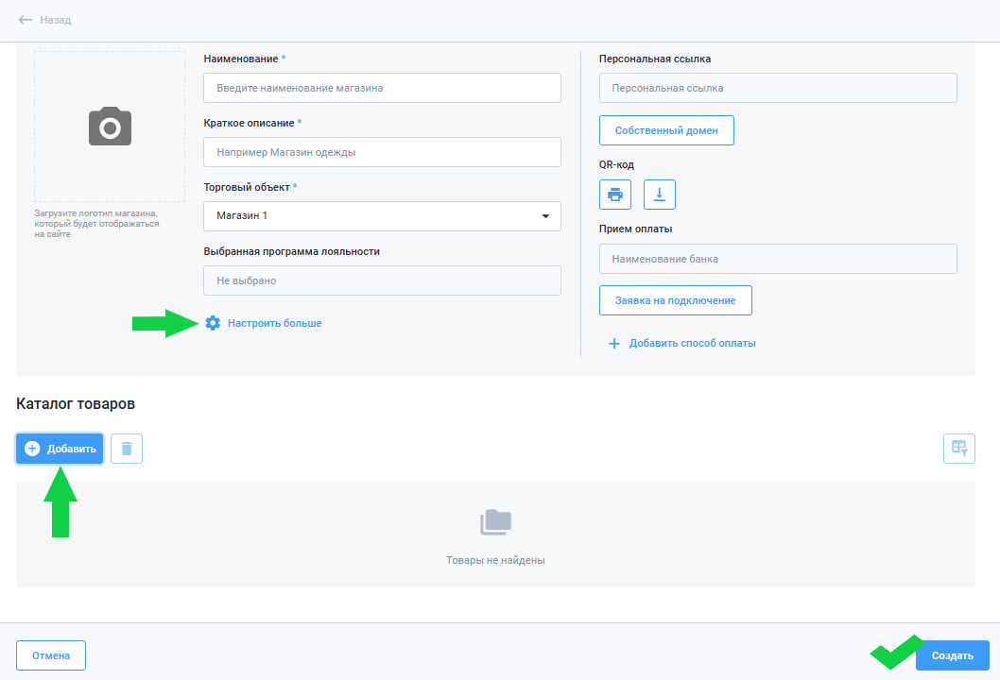
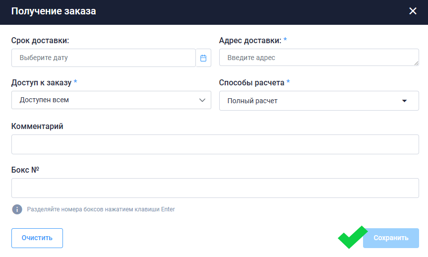
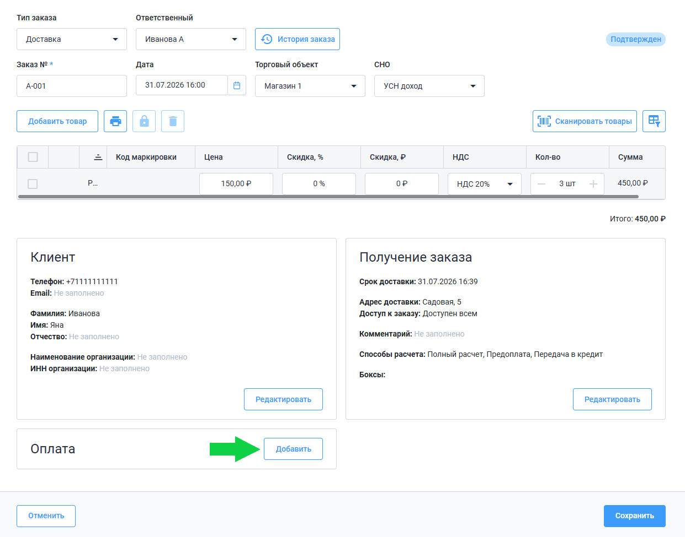
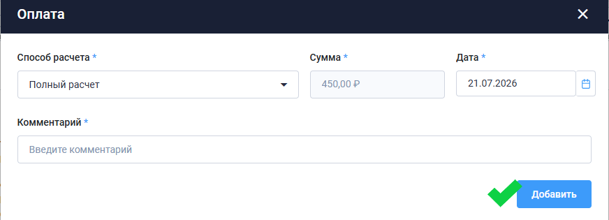
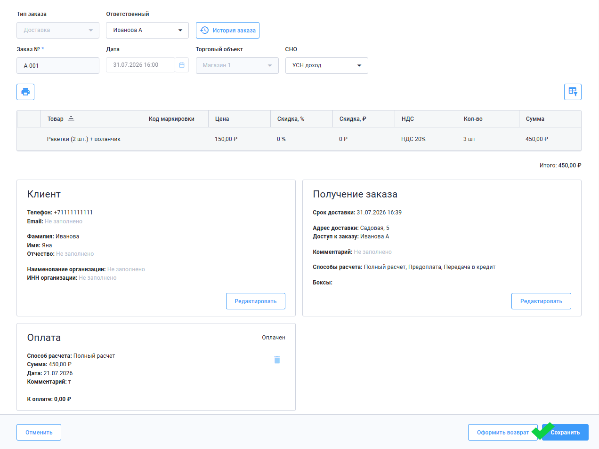
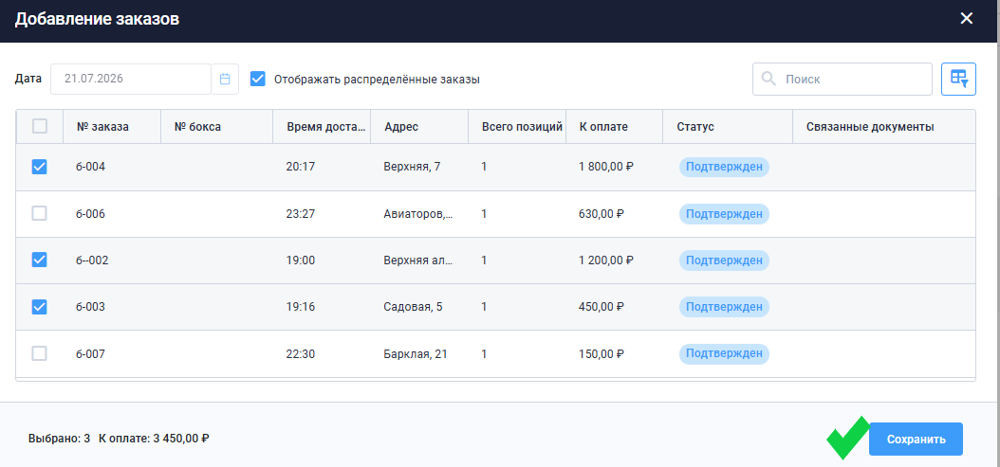
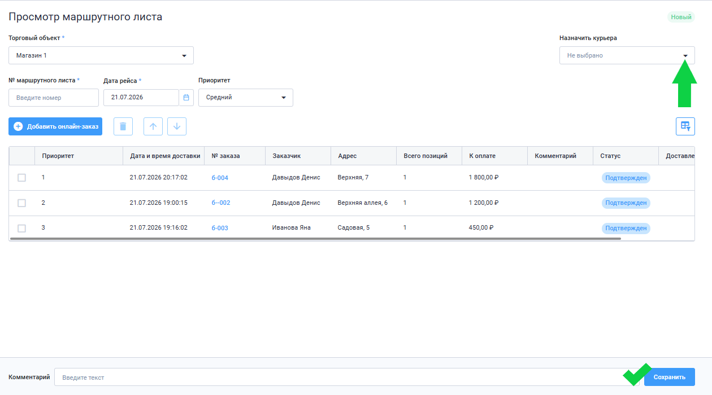

# Руководство пользователя

## Сокращения

**ГИС МТ** — Государственная информационная система мониторинга за оборотом товаров, подлежащих обязательной маркировке средствами идентификации

**ЕГАИС** — Единая государственная автоматизированная информационная система

**ККТ** – Контрольно-кассовая техника

**СБП** — Система быстрых платежей

**УТМ** — Универсальный транспортный модуль

**ФНС** — Федеральная налоговая служба

**ЭЦП** — Электронная цифровая подпись

**GTIN** — Global Trade Item Number, глобальный идентификатор товара

**KPI** — Key Performance Indicators, ключевые показатели эффективности

## Настройка учётной записи

### Регистрация

1. Для регистрации в личном кабинете перейдите на стартовую страницу **[БИФИТ Касса](https://kassa.bifit.ru/)**.
2. На верхней панели меню нажмите **Личный кабинет**.
3. В открывшемся окне выберите **Регистрация**. 
4. Заполните данные для регистрации: **Телефон**, **Фамилия**, **Имя**, **Пароль**.
5. Нажмите **Зарегистрироваться**.
6. Введите код подтверждения из SMS, отправленного на указанный номер телефона.

### Авторизация

1. Если учётная запись уже есть, войдите в **Личный кабинет** **[БИФИТ Касса](https://kassa.bifit.ru/)**.
2. В открывшемся окне выберите **Вход**.
3. Заполните данные для авторизации: **Телефон**, **Пароль**.
4. Нажмите **Войти**.

### Создание организации и торгового объекта 

При первом входе в личный кабинет откроется окно создания организации и торгового объекта.

1. В разделе **Организация** заполните поля **ИНН**, **Наименование**, **Адрес**, **Email**.
2. В разделе **Торговый объект** заполните поле **Наименование**. Выберите **Систему налогооблажения**. Местом расчётов может служить адрес, по которому находится торговый объект.
3. Нажмите **Создать**.

### Создание новой организации

1. Чтобы создать новую организацию, в меню личного кабинета нажмите на название действующей организации.
2. В выпадающем списке нажмите **Создать организацию**.
3. Повторите действия из предыдущего раздела.

### Создание нового торгового объекта 

1. В боковом меню выберите раздел **Управление** → **Торговые объекты**.
2. На странице торговых объектов нажмите **Создать**.
3. В открывшемся окне заполните информацию о торговом объекте, выберите систему налогообложения. Чтобы использовать справочник товаров организации, включите опцию **Использовать текущий справочник номенклатур**.
4. Нажмите **Создать**.
   

#### Редактирование торгового объекта 

1. В разделе **Управление** → **Торговые объекты** выберите торговый объект.
2. В открывшемся окне измените информацию о торговом объекте.
3. Нажмите **Сохранить**.

#### Удаление торгового объекта 

1. В разделе **Управление** → **Торговые объекты** выберите торговый объект.
2. В открывшемся окне нажмите **Удалить**.
3. Во всплывающем окне подтвердите удаление, нажав **Да**.

## Работа с БИФИТ Кассой

### Покупка лицензии

Купить лицензию, продлить или изменить тариф можно в разделе **Магазин** → **Покупки**.

1. На открывшейся странице нажмите **Купить лицензии**.

2. Во всплывающем окне выберите нужные опции.

3. Нажмите **Добавить**.

Подробное описание тарифов находится на сайте **[БИФИТ Касса](https://kassa.bifit.ru/)** в разделе **Тарифы**.

### Поддержка

В разделе **Поддержка** → **Контакты** указаны телефон технической поддержки и электронная почта сервиса БИФИТ Касса.

В разделе **Поддержка** → **Обращения** можно оставить обращение.

1. На странице создания обращения нажмите **Новое обращение**.
2. Во всплывающем окне выберите категорию, введите текст обращения или загрузите текстовый файл.
3. Нажмите **Отправить**.

## Настройка касс

### Подключение сканера штрихкода

Подключите сканер к устройству по USB.

### Настройка коннектора ККТ

Коннектор ККТ нужен, чтобы связать облачную или расшаренную кассу с кассовым программным обеспечением. Через него чеки формируются и отправляются на фискализацию на удалённую ККТ.

1. Перейдите в раздел **БИФИТ Онлайн** → **Коннекторы ККТ**.
2. На открывшемся экране нажмите **Создать**.
3. Во всплывающем окне заполните информацию о коннекторе:
   - Наименование коннектора (название торгового объекта или интернет-магазина);
   - URL-адрес. Если расчёты производятся на сайте, например, в интернет-магазине, указывается URL-адрес этого магазина. В ином случае необходимо указывать **https://kassa.bifit.ru/**; 
   - Система налогообложения.
4. Нажмите **Создать**.

### Подключение облачной кассы

**Аренда облачной кассы**

1. Обратитесь в отдел продаж **БИФИТ Касса**, приобретите лицензию на аренду облачной кассы и фискальный накопитель.
2. Авторизуйтесь в личном кабинете налоговой службы с помощью ЭЦП и заполните заявление на регистрацию ККТ.
3. Войдите в личный кабинет **БИФИТ Касса** и заполните поля, необходимые для фискализации кассы (раздел **БИФИТ Онлайн → Кассы**).
4. Вернитесь в личный кабинет налоговой и завершите регистрацию ККТ.

### Настройка рабочих мест

В разделе **Управление** → **Рабочие места** представлен список рабочих мест организации — устройств, подключенных к приложениям БИФИТ Касса.

> Рабочее место создаётся автоматически при подключении к организации в приложениях БИФИТ: "Касса Розница", "Касса" (Android), "Касса Курьер" и др.

1. Для изменения настроек выберите рабочее место и нажмите **Настройки**.
2. Во всплывающем окне можно изменить наименование рабочего места, выбрать приложение для работы и торговый объект.
3. Нажмите **Сохранить**.

Рабочие места можно объединять в группы по определённому признаку, например, по региону, приложению, торговой точке.

1. В разделе **Управление** → **Рабочие места** создайте группу рабочих мест, нажав на значок папки.
2. Введите наименование группы и нажмите **Создать**.
3. Отметьте рабочие места, которые хотите сгруппировать, и нажмите значок переноса. 
4. Выберете группу и нажмите **Переместить**.

## Настройка СБП

Для использования СБП в разделе **Магазин** → **Покупки** нужно приобрести лицензию СБП.

### Настройка провайдера

1. Перейдите в раздел **СБП** → **Настройки** и на открывшемся экране нажмите **Добавить**.
2. Во всплывающем окне выберите провайдер СБП, торговый объект и заполните данные об организации. 
3. Нажмите **Сохранить**.

### Создание QR-кода 

В разделе **СБП** → **QR-коды** возможно создать одноразовый QR-код и постоянную кассовую ссылку.

Выберите торговый объект, нажмите на **Одноразовый** или **Кассовая ссылка** и **Создать**.

Во всплывающем окне настройте параметры QR-кода и нажмите **Сохранить**.

Данные о покупках, совершённых по QR-коду, находятся в разделе **СБП** → **Платежи**.

## Внешние подключения

### Интеграция с системой МАХ для подтверждения возраста с помощью Цифрового ID.

> Согласно Постановлению Правительства РФ от 17 февраля 2026 года № 148, продавцы обязаны проверять сведения о личности, возрасте и праве на льготы, если покупатель предоставляет их через многофункциональный сервис обмена информацией — мессенджер MAX. Отказ в такой проверке приравнивается к нарушению правил торговли.

#### Подключение организации к сервису Цифрового ID

1. Зарегистрируйтесь в сервисе **[МАХ для бизнеса](https://business.max.ru/)**. 
2. Для регистрации используйте **[инструкцию](https://dev.max.ru/docs/maxbusiness/connection?utm_source=b2bmax&utm_medium=documentation_2_screen&utm_campaign=landing)**.
3. Подключите организацию к **[сервису Цифрового ID на платформе MAХ](https://dev.max.ru/docs/digital-id)** и получите токен вашей организации.

#### Настройка подключения в сервисе БИФИТ Касса

1. Перейдите в раздел **Управление** → **Внешние подключения**.
2. Нажмите **Настроить подключение**.
3. В поле **Канал** выберите значение **МАХ**.
4. В поле **Токен** введите токен, полученный в личном кабинете **МАХ для бизнеса**. 
5. Нажмите **Подключить**.

## Сотрудники

### Роли 

В сервисе БИФИТ Касса предусмотрен набор ролей с правами по умолчанию — **Администратор**, **Кассир**, **Курьер**, **Старший кассир**. Каждая роль определяет, какие действия доступны сотруднику в приложении и личном кабинете. **Администратор** обладает всеми правами. 

В личном кабинете БИФИТ Касса можно создать новые роли и настроить права.

#### Создание роли

1. В боковом меню выберите разделы **Управление** → **Роли**.
2. На открывшемся экране нажмите **Создать**.
3. В появившемся окне укажите название роли и настройте поля, отметив необходимые пункты, и нажмите **Добавить**.

### Учетная запись сотрудника

Учётную запись нового сотрудника создаёт администратор в личном кабинете БИФИТ Касса.

#### Добавление нового сотрудника

1. В боковом меню выберите разделы **Управление** → **Сотрудники**.
2. На открывшемся экране нажмите **Добавить**.
3. В появившемся окне заполните информацию о сотруднике: **Номер телефона сотрудника**, **Фамилию**, **Имя**. Выберите торговые объекты, к которым сотрудник будет иметь доступ.

> **Важно!**
> 
> Номер телефона является логином для входа в личный кабинет **БИФИТ Касса** и приложение **Касса Розница**, **Касса**, **Касса Курьер** и др. 
> При добавлении сотрудника на его номер придёт СМС с паролем для входа в личный кабинет и приложения сервиса. Сотрудник может изменить пароль в своём профиле.

##### Изменение пароля

1. Нажмите на своё имя в меню личного кабинета для перехода в профиль.
2. Нажмите **Изменить пароль**.
3. Во всплывающем окне введите старый пароль, который пришёл в СМС, и новый пароль. Нажмите **Сохранить**.
4. На экране профиля нажмите **Сохранить**.

#### Редактирование сотрудника

1. В боковом меню выберите раздел **Управление** → **Сотрудники**.
2. В списке выберите нужного сотрудника.
3. В открывшемся окне измените информацию о сотруднике, должности, роль и права, если это необходимо.
4. Нажмите **Сохранить**.

#### Удаление сотрудника

1. В разделе **Управление** → **Сотрудники** выберите нужного сотрудника.
2. В открывшемся окне нажмите **Удалить**.
3. Во всплывающем окне подтвердите удаление, нажав **Да**.

#### Восстановление сотрудника

1. В разделе **Управление** → **Сотрудники** активируйте опцию **Показывать удалённых**. В поле **Поиск** можно найти сотрудника, введя имя и фамилию.
2. В списке выберите нужного сотрудника.
3. В открывшемся окне нажмите **Восстановить**.
4. Во всплывающем окне подтвердите восстановление, нажав **Да**.
   

 

### Отчёты

В разделе **Управление** → **Отчёты** указана статистика по ключевым показателям эффективности (**KPI сотрудников**) и учёту рабочего времени (**Табель рабочего времени**).

## Работа со складом

В личном кабинете можно вести учёт реализуемых позиций и добавлять их в справочник товаров организации или торгового объекта.

### Справочник товаров

В справочнике товаров формируется список номенклатурных позиций организации (товаров). Товары можно объединять в категории.

#### Создание товара {#создание-товара}

1. В боковом меню выберите разделы **Склад** → **Товары и категории**.
2. На открывшейся странице нажмите **Создать товар**.
3. Укажите наименование, цену продажи. Возможно внесение штрихкода. 
4. В разделе **Дополнительная информация** укажите **Предмет расчёта** и другие пункты, если необходимо. 
5. Нажмите **Сохранить** или **Сохранить и создать следующий**, чтобы открыть окно создания нового товара.

##### Создание маркированного товара {#создание-маркированного-товара}

На странице создания товара в разделе **Дополнительная информация** укажите тип маркировки и введите значение **GTIN**.

> **Важно!**
>
> GTIN не предусмотрен для следующих значений:
> алкоголь;
> СИЗ;
> ветеринарный препарат.
> Для этих товаров необходимо выбрать соответствующий тип маркировки.

##### Создание весового товара (дробное количество)

На странице создания товара в разделе **Дополнительная информация** выберите опцию **Дробное количество** и выберите единицу измерения (килограмм, грамм, литр и др.).

##### Создание комплекта

Комплект — несколько отдельных товаров, которые продаются вместе как один набор. Например, набор для рисования: карандаши + бумага.

1. В разделе **Товары и категории** нажмите **Создать**.
2. На странице создания товара выберите тип товара **Комплект**.
3. Введите наименование и цену продажи.
4. В разделе **Состав комплекта** нажмите **Добавить товар**.
5. В открывшемся окне отметьте товары для комплекта и установите количество каждого товара в комплекте.
6. Нажмите **Добавить**.
7. После возвращения на экран создания товара нажмите **Сохранить**.

##### Создание рецепта

Рецепт — набор ингредиентов, из которых состоит одна позиция. Например, капучино включает молоко, эспрессо и сироп. Рецепт создаётся, когда нужно учитывать расход компонентов для приготовления одного блюда или напитка. 

1. В разделе **Товары и категории** нажмите **Создать**.
2. На странице создания товара выберите тип товара **Рецепт**.
3. Введите наименование и цену продажи.
4. В разделе **Состав рецепта** нажмите **Добавить товар**.
5. В открывшемся окне отметьте ингредиенты для рецепта и установите количество каждого ингридиента в рецепте.
6. Нажмите **Добавить**.
7. После возвращения на экран создания товара нажмите **Сохранить**.

##### Баллы KPI 

Баллы KPI присваиваются сотрудникам на основе реализованного товара. Для каждой номенклатурной позиции можно установить определённое количество баллов и отслеживать эффективность продаж конкретного товара или группы товаров.

1. В разделе **Товары и категории** выберите товар, которому нужно присвоить баллы KPI.
2. На странице создания товара в разделе **Сотрудники** укажите количество баллов KPI.
3. В разделе **Торговые объекты** можно установить разное количество баллов для товара.
4. Нажмите **Сохранить**. 

##### Внесение товара в стоп-лист

Чтобы остановить реализацию товара в торговом объекта, в справочнике есть возможность внести его в стоп-лист.

1. В разделе **Товары и категории** выберите товар, который нужно внести в стоп-лист.
2. На странице создания товара  включите опцию **В стоп-листе** напротив нужного торгового объекта.
3. Нажмите **Сохранить**. 

##### Удаление товара из справочника

**Способ 1**

1. В разделе **Товары и категории** отметьте товар или несколько товаров.
2. Нажмите на значок удаления на верхней панели.
3. Во всплывающем окне подтвердите удаление, нажав **Да**.

**Способ 2**

1. В разделе **Товары и категории** откройте страницу товара.
2. На странице товара в нижней части нажмите **Удалить**.
3. Во всплывающем окне подтвердите удаление, нажав **Да**.

#### Создание категории

1. В боковом меню выберите разделы **Склад** → **Товары и категории**.
2. На открывшейся странице нажмите **Создать категорию**.
3. Во всплывающем окне укажите наименование категории и выберите торговый объект. Нажмите **Сохранить**.
4. Категория появится в списке товаров в виде каталога. Для добавления товаров в категорию нажмите на неё.
5. Внутри каталога товар создаётся так же, как в шаге [Создание товара](#создание-товара). 

#### Загрузка товаров из CSV-файла в организацию {#загрузка-товаров-из-csv-файла-в-организацию}

С помощью загрузки товаров можно добавить сразу несколько позиций в справочник из CSV-файла.

1. В разделе **Товары и категории** на верхней панели выберите **Импортировать из CSV**.
2. В открывшемся окне нажмите **Скачать шаблон**.
3. Заполните CSV-файл и сохраните.
4. В разделе **Товары и категории** на верхней панели снова откройте **Импортировать из CSV**.
5. В открывшемся окне нажмите **Выбрать файл для загрузки** и загрузите заполненный CSV-файл.
6. Нажмите **Импорт**.
   
Товары из таблицы появятся в справочнике организации. 

#### Выгрузка товаров из организации {#выгрузка-товаров-из-организации}

Справочник организации можно сохранить в CSV-файле.

1. В разделе **Товары и категории** на верхней панели выберите **Экспортировать в CSV**.
2. Во всплывающем окне нажмите **Экспорт**.

### Контрагент

В сервисе БИФИТ Касса можно настроить приём агентских платежей.

1. В боковом меню выберите разделы **Склад** → **Контрагенты**.
2. На открывшейся странице нажмите **Создать**.
3. Во всплывающем окне укажите ИНН организации контрагента, наименование. Выберите группу. Нажмите **Сохранить**.

> Сервис Индикатор проверяет надёжность контрагентов по открытым источникам госорганов. Это помогает соблюдать рекомендации ФНС по должной осмотрительности (письмо № АС-4-2/710@ от 23.01.2013).
>
> После ввода ИНН доступна опция **Действующее предприятие**. При нажатии на ссылку в браузере откроется страница сервиса БИФИТ Индикатор с подробной информацией о контрагенте.

### Операции по складу

Для проведения операций по складу перейдите в разделы **Склад** → **Операции**.

> При создании каждой операции можно указать номер вручную, или он сформируется автоматически после проведения. 
> 
> Формат номера: AA 0000000, где:
> 
> - AA — первые две буквы действия над товаром;
> 
> - 0000000 — порядковый номер, первые четыре цифры которого соответствуют году и месяцу создания документа.

#### Оприходование

1. В разделе операции выберите **Оприходование**.
2. На странице создания документа нажмите **Создать**.
3. На открывшемся экране укажите торговый объект, выберите товары для оприходования, нажмите **Добавить**.
4. Нажмите **Провести**.

> Список товаров можно загрузить из CSV-файла или сохранить сформированный список на ПК. 
> Загрузка и выгрузка CSV-файлов аналогичны действиям в разделах [Загрузка товаров из CSV-файла в организацию](#загрузка-товаров-из-csv-файла-в-организацию) и [Выгрузка товаров из организации](#выгрузка-товаров-из-организации).

Документы по другим операциям формируются аналогично в разделах **Склад** → **Операции**: 

**Списание** — снятие товара с учёта без продажи.

**Реализация** — списание товара со склада с получением оплаты.

**Инвентаризация** — сверка фактических остатков с данными системы.

**Перемещение** — передача товара между торговыми объектами. При создании перемещения необходимо указать два торговых объекта: **Отправитель** (с какого склада списывается товар) и **Получатель** (на какой склад приходуется).

**Производство** — списание товаров, составляющих комплект.

**Расформирование комплекта** — расформирование набора на отдельные товары.

**Заказ на закупку** — формирование заказа поставщику.

### Настройка характеристик

В сервисе БИФИТ Касса можно присвоить характеристики товарам.

#### Создание характеристик

1. В боковом меню выберите разделы **Склад** → **Характеристики**.
2. На открывшейся странице нажмите **Создать**.
3. Во всплывающем окне укажите наименование характеристики, тип значения (число, текстовое значение и др.), введите значение.
4. Нажмите **Сохранить**.

#### Создание групп характеристик

1. В боковом меню выберите разделы **Склад** → **Группы характеристик**.
2. На открывшейся странице нажмите **Создать**.
3. Во всплывающем окне укажите наименование группы характеристик и выберите характеристики для привязки.
4. Нажмите **Сохранить**.

#### Присвоение характеристик товарам

1. Перейдите в справочник товаров в разделе **Товары и категории**.
2. Перейдите в карточку товара, нажав на него.
3. Переместитесь в нижнюю часть открывшегося экрана до раздела **Варианты** и нажмите **Добавить вариант**.
4. Во всплывающем окне нажмите **Настроить**.
5. Настройте характеристики и нажмите **Сохранить**.

## Лояльность 

Сервис БИФИТ Касса позволяет настроить несколько типов лояльности: программу лояльности, товар в подарок, купоны, товары по акции.

### Создание лояльности

#### Программы лояльности

1. В боковом меню выберите разделы **Лояльность** → **Операции** → **Программы лояльности**.
2. На открывшейся странице нажмите **Создать**.
3. На экране создания программы лояльности введите наименование программы, выберите тип программы (дисконтная, накопительная), настройте параметры.
4. Нажмите **Запустить**.

На экране создания программы лояльности в правой части представлено подробное описание каждого типа.

Другие варианты лояльности создаются аналогично в разделах **Лояльность** → **Операции**: 

**Товар в подарок** — позволяет настроить скидку на товар или группу товаров.

**Купоны** — система вознаграждения за покупки.

#### Товары по акции

1. В боковом меню выберите разделы **Лояльность** → **Операции** → **Товары по акции**.
2. На открывшейся странице нажмите **Добавить**.
3. Введите наименование, выберите торговый объект, настройте параметры акции и добавьте товары.
4. Нажмите **Запустить**.

#### Совместное применение

Группы совместного применения позволяют настроить взаимодействие нескольких лояльностей: какие из них применять вместе, какая будет приоритетной, как рассчитывается итоговая цена.

1. В боковом меню выберите разделы **Лояльность** → **Настройки** → **Совместное применение**.
2. На открывшейся странице нажмите **Создать**.
3. Во всплывающем окне введите наименование группы и выберите условие совместного применения:
   
   - **Минимум** — из всех лояльностей, указанных в группе, будет выбрана минимальная.

   - **Максимум** — из всех лояльностей, указанных в группе, будет выбрана максимальная.

   - **Сложение** — все лояльности будут складываться по арифметическому правилу.

   - **Вытеснение** — лояльность, расположенная выше по иерархическому порядку, будет вытеснять лояльность, расположенную ниже в иерархическом порядке. Будет применяться скидка с более высокой стоиомостью.

   - **Последовательное применение** — лояльность будет применяться последовательно в зависимости от иерархического расположения в корневой папке.
4. Нажмите **Сохранить**.   

### Клиенты

Сервис БИФИТ Касса позволяет вести учёт клиентов организации и добавлять их в программу лояльности.

1. В боковом меню выберите разделы **Лояльность** → **Справочники** → **Клиенты**.
2. На открывшейся странице нажмите **Добавить**.
3. Во всплывающем окне заполните данные клиента, введите или сгенерируйте номер карты лояльности.
4. Нажмите **Сохранить**.

## Кассовые операции

Для формирования фискальных документов перейдите в разделы **БИФИТ Онлайн** → **Создание чека**.

### Приход

На экране создания чека выберите режим **Приход**.

**Добавление в чек товара из справочника**:

1. В правой части экрана нажмите на товары в справочнике, чтобы добавить их в чек.
2. Чтобы изменить количество товара в чеке или способ расчёта, нажмите на товар чеке. 
3. Во всплывающем окне настройте параметры товара. Нажмите **Сохранить**.
4. Нажмите **Сформировать чек**.
5. На экране оплаты выберите способ оплаты и сумму. Чтобы отправить чек покупателю, введите E-mail или номер телефона. Нажмите **Сформировать чек**.

**Добавление в чек товара по свободной цене**:

1. На экране создания чека нажмите **Свободная цена**.
2. Во всплывающем окне настройте параметры товара. Нажмите **Добавить в чек**.
3. Нажмите **Сформировать чек**.
4. На экране оплаты выберите способ оплаты и сумму. Чтобы отправить чек покупателю, введите E-mail или номер телефона. Нажмите **Сформировать чек**.

Документы по другим операциям формируются аналогично на экране создания чека: 

- **Возврат прихода** 

- **Расход**

- **Возврат расхода**

- **Коррекция прихода**

- **Коррекция расхода**

- **Коррекция возврата прихода**

- **Коррекция возврата расхода**

## Онлайн-заказы

В разделе формируются онлайн-заказы для передачи в приложение **Касса Курьер**.

Для работы с онлайн-заказами перейдите в раздел. 

### Интернет-магазины

Инструмент для запуска онлайн-продаж. Каждый пользователь БИФИТ Касса может создать интернет-витрину, разместить товары и получать заказы онлайн.

1. В боковом меню выберите разделы **Онлайн-заказы** → **Интернет-магазины**.
2. На открывшейся странице нажмите **Создать**.
3. На экране создания магазина введите наименование, краткое описание, выберите торговый объект, введите персональную ссылку, нажав **Собственный домен**.
4. Опция **Настроить больше** позволяет установить типы доставки, режим работы магазина, выбрать программу лояльности.
5. В разделе **Каталог товаров** нажмите **Добавить**, чтобы выбрать товары для интернет-продажи. 
6. Нажмите **Создать**.

### Создание заказа

1. Перейдите в раздел **Онлайн-заказы**.
2. На открывшейся странице нажмите **Создать**.
3. На экране формирования заказа укажите тип заказа:
   - Доставка;
   - Самовывоз;
   - Забор (забор заказа у покупателя при возврате).
4. Укажите номер заказа, дату заказа, торговый объект, из которого формируется заказ, добавьте товары. 
5. В разделе **Клиент** нажмите **Добавить**. Во всплывающем окне заполните информацию о клиенте и нажмите **Сохранить**.
6. В разделе **Получение заказа** нажмите **Редактировать**. 
7. Во всплывающем окне заполните информацию о заказе. В поле **Доступ к заказу** укажите сотрудника, на которого распределён заказ, или сделайте заказ доступным всем — в этом случае в приложении **Касса Курьер** заказ будет доступен всем сотрудникам организации. В поле **Бокс** можно присвоить номер упаковки товара для поиска заказа. 
8. Нажмите **Сохранить**.
9. В разделе **Оплата** нажмите **Добавить**.
10. Во всплывающем окне выберите способ расчёта и дату оплаты. Нажмите **Добавить**.
11. После заполнения всех параметров заказа нажмите **Сохранить**. Новый заказ появится в приложении **Касса Курьер**.
   

### Создание маршрутного листа

Маршрутный лист — инструмент для группировки онлайн-заказов организации по определенному признаку (округ, линия метро и др.).
1. Перейдите в раздел **Онлайн-заказы** → **Маршрутные листы**.
2. Нажмите **Создать** на открывшейся странице.  
3. На экране формирования маршрутного листа укажите торговый объект, введите номер маршрутного листа, укажите дату рейса. Нажмите **Добавить онлайн-заказ**.
4. Во всплывающем окне отметьте опцию **Отображать распределённые заказы**
5. Отметьте заказы для маршрутного листа. Нажмите **Сохранить**.
6. На экране формирования маршрутного листа можно назначить курьера и ввести комментарий при необходимости.
7. Нажмите **Сохранить**.

Сотрудник может найти созданный маршутный лист по номеру в приложении **Касса Курьер** в разделе **Маршутные листы**.

### Покупатели

В раздел автоматически попадают клиенты, оформившие онлайн-заказы.

Нажмите на покупателя, чтобы посмотреть информацию о нём и историю покупок.

Нажмите **Добавить**, чтобы внести нового покупателя в список. Заполните данные о покупателе и нажмите **Сохранить**.

> Список покупателей можно загрузить из CSV-файла или сохранить сформированный список на ПК. 
> Загрузка и выгрузка CSV-файлов аналогичны действиям в разделах [Загрузка товаров из CSV-файла в организацию](#загрузка-товаров-из-csv-файла-в-организацию) и [Выгрузка товаров из организации](#выгрузка-товаров-из-организации).

## Статистика по организации

### Аналитика

В разделе представлен отчёт о деятельности организации за указанный период времени.

Отчёт можно посмотреть по всей организации или по одному из торговых объектов.

Возле поля выбора торгового объекта находится опция **Экспортировать отчёт по аналитике в CSV**. 

Показатели, представленные в отчёте:

1. Сумма продаж.
2. Сумма возвратов.
3. Количество чеков.
4. Сумма среднего чека.
5. Гистограмму с показателями продаж за выбранный период.
6. Рейтинг продаж по товарам.
7. Рейтинг кассиров:
- По продажам;
- По KPI.
8. Рейтинг продаж по торговым объектам.
9. Денежные средства по способам оплаты.

### Чеки

В разделе представлен отчёт по всем кассовым документам.

Отчёт можно фильтровать по торговому объекту, кассиру, дате, статусу чека, типу чека, типу оплаты.

В разделе есть опция выгрузки отчёта в формате CSV, а также отчёта о чеках с кодом Data Matrix, в которых зафиксирована продажа маркированной продукции.

### Продажи

В разделе представлен отчёт по продажам товаров и услуг организации. 

Отчёт можно фильтровать по торговому объекту, кассиру, категории, дате.

Итоги таблицы содержат информацию о количестве позиций, сумме закупок, продаж и прибыли.

В разделе есть опция выгрузки отчёта в формате CSV.

## ЕГАИС 

### Подключение

Правовая информация  и инструкция по подключению к системе ЕГАИС находится на сайте **[Федеральной службы по контролю за алкогольным и табачным рынками ](https://fsrar.gov.ru/egais)**.
Для передачи данных о закупках и продажах алкоголя В ЕГАИС необходимо установить **УТМ**.

В личном кабинете ЕГАИС скачайте файл установки **УТМ** и установите на рабочем комьютере организации. 

После установки **УТМ** необходимо добавить в личный кабинет БИФИТ Касса. 

1. Перейдите в раздел **ЕГАИС** → **Алкогольная продукция**.
2. Нажмите **Добавить УТМ**.
3. Во всплывающем окне выберите торговый объект, проверьте настройки локального хоста и порта и нажмите **Проверить подключение**.

> Важно!
>
> Процедуру добавления нужно проводить в каждом торговом объекте, где реализуется алкогольная продукция.

### Принятие накладной

Чтобы алкогольная продукция появилась на учёте организации, необходимо принять её в соответствующем разделе.

Перейдите в раздел **ЕГАИС** → **Накладные**. Нажмите на накладные со статусом *Новый*.

### Добавление в справочник

Карточка товара нужно заранее создать в разделе **Склад** → **Товары и категории**. При создании карточки товара необходимо указывать, что продукция маркированная — шаг [Создание маркированного товара](#создание-маркированного-товара). 

1. Перейдите в раздел **ЕГАИС** → **Алкогольная продукция**.
2. Выберите накладную из списка и нажмите **Привязать**. 
3. Во всплывающем окне выберите товар из справочника организации, к которму нужно привязать накладную и нажмите **Привязать**.

### Реализация алкоголя в розлив

Реализация алкоголя порционно и пива в розлив оформляется в приложении **"Касса" Android** в разделе **Учётные документы**. 

После оформления в приложении информация о вскрытой таре появится в личном кабинете БИФИТ Касса в разделах **ЕГАИС** → **Вскрытие тары** и **Вскрытие кег**. 

#### Вскрытие тары

1. Выберите тип продукции — **Маркированная**, **Немаркированная**.
2. Отметьте товар в списке.
3. Выберите **Списать со склада** или **Списать из торгового зала**.
4. Во всплывающем окне нажмите **Отправить в УТМ**.
   

#### Вскрытие кег

Для отправки данных в ГИС МТ о вскрытых кегах перейдите в раздел **ЕГАИС** → **Вскрытие кег**. Отметьте кегу и нажмите **Отправить данные в ГИС МТ**.

### Создание декларации

1. Перейдите в раздел **ЕГАИС** → **Декларации** и нажмите **Создать**.
2. Во всплывающем окне выберите форму декларации и укажите дату предыдущей декларации, если она была.
      - 7 форма. Декларация об объеме оборота розничной продажи алкогольной (за исключением пива и пивных напитков, сидра, пуаре и медовухи) и спиртосодержащей продукции.
      - 8 форма. Декларация об объёме розничной продажи пива и пивных напитков, сидра, пуаре и медовухи.
3. Внесите информацию и нажмите **Сохранить**.

