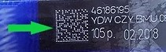
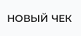
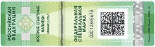
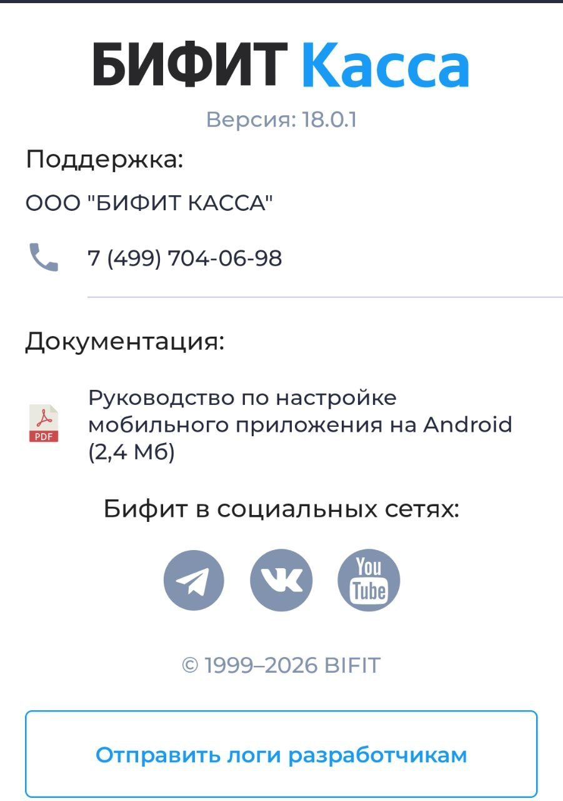

## Сокращения

**ККТ** — Контрольно-Кассовая Техника

**ОФД** — Оператор Фискальных Данных

**РМК** — Рабочее Место Кассира

**СНО** — Система Налогообложения

**ФНС** — Федеральная Налоговая Служба

**ФФД** — Формат Фискальных Документов

**GTIN** — Global Trade Item Number, глобальный идентификатор товара

**POS-терминал** — платёжный терминал, (Point of Sale — точка продажи)

## Введение

Данный документ рассчитан на пользователей мобильного приложения и описывает процедуру по редактированию справочника товаров и оформлению фискальных документов (чеков).

## Запуск приложения

1. Убедитесь, что приложение установлено, учётная запись создана, а кассовый аппарат и платёжный терминал подключены. Подробнее см. в документе [«Установка и настройка приложения "Касса" Android»](<../установка/Установка-и-настройка-«Касса»-(android).md>).
2. При входе в приложение выберите учётную запись.
3. Введите код доступа.
4. Выберите организацию и торговый объект. Если в приложении задана одна организация или один торговый объект, то приложение выберет их автоматически.

Произойдёт переход на экран **рабочего места кассира** (далее — **РМК**).

## Редактирование справочника товаров

Приложение позволяет вести учёт реализуемых позиций и добавлять их в справочник товаров организации или торгового объекта.

Редактировать справочник товаров может пользователь с правами администратора или старшего кассира.

### Добавление товаров в справочник

На экране РМК перейдите в меню и выберите раздел **Товары**.

На этом экране можно добавить товар или группу товаров.

#### Добавление товара

1. На экране справочника нажмите **+** и выберите **Добавить товар**.
2. В карточке товара необходимо ввести данные о товаре:

- Наименование
- Цена
- НДС
3. Нажмите **Создать**.

Опция **Отображать только в текущем торговом объекте** скрывает товар от других торговых объектов организации.

#### Добавление категории

1. На экране справочника нажмите **+** и выберите **Добавить категорию**.
2. Введите имя категории и нажмите **Создать**.
3. На экране справочника нажмите на папку.
4. Создание товаров в папке происходит так же, как на главном экране справочника.

#### Добавление товаров со штрихкодом

При добавлении товара в соответствующем поле введите значение или отсканируйте штрихкод на товаре.

> Чтобы подключить сканер штрихкода в режиме эмуляции клавиатуры, в приложении **Касса** не нужно производить специальных настроек.
>
> Убедитесь, что сканер работает по USB или Bluetooth в режиме эмуляции клавиатуры. Эту информацию можно уточнить у продавца оборудования. Подключите сканер к USB-разъёму или создайте Bluetooth-соединение с устройством.
>
> Для работы с маркированными товарами сканер должен быть настроен в режиме эмуляции COM-порта.

Если вы хотите использовать в качестве сканера штрихкода встроенную камеру устройства, на экране нажмите кнопку сканера штрихкода.

Поместите штрихкод в объектив камеры. Данные появятся в соответствующем поле.

#### Добавление весового товара или товара, измеряемого дробным количеством

1. При добавлении товара в окне карточки товара нажмите **Дополнительно**.
2. Выберите опцию **Дробное количество**.
3. Выберите единицу измерения (например, килограмм) — цена установится за одну единицу. При продаже укажите количество товара: например, 2,5 кг.

#### Добавление маркированной продукции

1. При добавлении товара в окне карточки товара нажмите **Дополнительно**.
2. В поле **GTIN** введите значение GTIN вручную или отсканируйте код Data Matrix.
3. Выберите тип маркировки.

> Сканирование GTIN не предусмотрено для следующих значений:
>
> - алкоголь;
> - СИЗ;
> - ветеринарный препарат.
>
> Для этих товаров необходимо выбрать соответствующий тип маркировки.

### Добавление в чек товара 18+

1. После добавления в чек товаров нажмите **Итог**. В появившемся окне подтверждения возраста нажмите **Сканировать QR-код**.
2. Отсканируйте данные на устройстве покупателя сканером на кассе.
3. В случае ошибки нажмите **Повторить попытку**.
4. Если приложение МАХ покупателя не работает или у покупателя нет Цифрового ID, выберите опцию **Подтвердить без МАХ**. Откроется окно подтверждения возраста.
5. Если покупателю исполнилось 18 лет, в окне подтверждения нажмите **Да, есть 18**. Во всплывающем окне «*Возраст подтверждён*» нажмите **Закрыть**.
6. Если покупателю не исполнилось 18 лет или нет возможности подтвердить возраст, нажмите **Нет, удалить товар**. Во всплывающем окне «*Товар удалён*» нажмите **Закрыть**.
7. Продолжите добавление в чек других товаров. 

#### Удаление товаров из справочника

Чтобы удалить товар, на экране справочника откройте карточку товара, однократно нажав на него. В правом верхнем углу выберите удаление.

Также на экране справочника можно удалить товар, выбрав его долгим нажатием. В правом верхнем углу экрана появится опция удаления.

Чтобы удалить несколько товаров, нужно выбрать их долгим нажатием, затем выбрать удаление.

## Экран РМК

На экране **РМК** происходит оформление покупок:

- оформление товаров и услуг;
- редактирование позиций в чеке;
- назначение скидок.

После входа в приложение экран рабочего места кассира по умолчанию открывается в режиме **Приход**. Выбрать другую кассовую операцию можно в меню в верхнем левом углу. Доступны следующие операции:

- Приход
- Возврат прихода
- Расход
- Внесение
- Выплата

После добавления товара в чек на экране рабочего места кассира доступны следующие функции:

-  **Добавить информацию о клиенте** — в окне можно указать ФИО, номер телефона и/или E-mail клиента для отправки электронной копии чека.
-  **Добавить скидку на чек** — доступен выбор процентной скидки на товар. После добавления скидка распределяется по всем позициям в чеке.
-  **Добавить комментарий в чек**.
-  **Удалить чек**.
-  **Отложенные чеки** — откроется вкладка со всеми отложенными чеками, которые были не до конца сформированы.
-  **Добавить новый чек** — откроется новый пустой чек без товаров.

Для оплаты нажмите **Итог: (сумма)**.

> Ниже рассмотрен пример работы приложения с фискальным документом «Приход». Он оформляется кассиром при продаже товаров и услуг.

На экране в режиме **Приход** доступны следующие действия:

- добавление товара в чек по штрихкоду;
- добавление товара в чек из справочника: **Добавить товар**;
- добавление товара в чек с указанием наименования, цены и НДС: **Свободная цена**.

### Добавление товара в чек по штрихкоду

Перейдите в окно РМК и отсканируйте штрихкод на товаре.

При использовании встроенной камеры откроется окно сканирования штрихкода. Поместите штрихкод в окно сканирования. При наличии товара в справочнике в нижней части экрана появится его наименование.

При повторном сканировании товара его количество изменится.

При плохом освещении воспользуйтесь фонариком, чтобы подсветить штрихкод.

Нажмите кнопку подтверждения  для добавления товара в чек.

### Добавление в чек товара из справочника

Нажмите **Добавить товар** в правой нижней части экрана.

Откроется справочник товаров.

Выберите товары и нажмите кнопку подтверждения . Выбранные позиции добавятся в чек и будут отображаться на экране РМК.

### Добавление в чек товара по свободной цене

Товар по свободной цене — товар, не внесённый в справочник товаров. Цена на такой товар устанавливается вручную в момент продажи.

Для добавления в чек товара по свободной цене нажмите **Свободная цена** в левой нижней части экрана.

В открывшемся окне введите цену товара. Обратите внимание, что поля:

- Наименование;
- НДС;
- Количество;
- Способ оплаты;
- Предмет расчёта

уже заполнены. При необходимости их можно изменить.

Введите нужные значения и нажмите **Добавить в чек**. Позиции добавятся в чек.

> При продаже по свободной цене следующие значения можно задать по умолчанию:
>
> - Наименование позиции;
> Предмет расчёта;
> Тип НДС.
> 
> Это можно сделать в меню **Настройки**, в разделе **Дополнительно** → категория **Продажа по свободной цене**.

### Добавление в чек весового товара

**Весовой товар** — продукция, измеряемая дробными величинами, например килограммами, граммами, литрами.

Для добавления в чек весового товара необходимо передать в приложение **точное количество товара**, например 0,532 кг.

#### Добавление в чек весового товара вручную

Добавление весового товара вручную означает, что у кассира есть возможность измерить вес товара, например на электронных весах, присутствующих на **рабочем месте кассира**, но не подключённых к устройству.

Для добавления в чек весового товара на экране **Приход** нажмите **Добавить товар**, перейдите в справочник, выберите весовой товар и в окне **количество товара** введите точное количество граммов или килограммов.

#### Добавление в чек весового товара электронными весами

> Для автоматизации рабочего места кассира приложение «Касса» позволяет подключить электронные весы к Android-устройству по USB. Подключите весы к устройству по USB, перейдите в **Настройки** → раздел **Весы**. Выберите тип весов и настройте подключение.

Для добавления в чек весового товара на экране **Приход** нажмите **Добавить товар**, перейдите в справочник, выберите весовой товар. Положите товар на весы. Поле **Количество товара** заполнится автоматически. При изменении веса нажмите **Взвесить**.

### Продажа маркированной продукции

1. Отсканируйте код **Data Matrix**, нанесённый на упаковку. При выбытии алкогольной продукции необходимо отсканировать **Data Matrix** на акцизной марке.
2. На экране появятся результаты проверки маркировки.
3. Если результат проверки положительный, нажмите **Далее**.
4. Если результат проверки отрицательный, исключите заблокированные к продаже товары и продолжите пробитие чека без них.

### Приём платежей в качестве агента

**Агентский платёж** — приём денег за услуги или товар в пользу третьих лиц, например, при оплате ЖКХ или сотовой связи.

> Для продажи агентских услуг пользователь с правами администратора должен предварительно выполнить настройки в **Личном кабинете БИФИТ Касса**. После этого нужно перезагрузить приложение, чтобы агентская услуга отображалась на РМК в списке товаров.

Добавьте агентскую услугу в чек как обычный товар, укажите цену и нажмите **Оплатить**.

### Редактирование позиций в чеке

После добавления позиции в чек её можно отредактировать или удалить из чека.

Скопировать или удалить позиции можно при помощи долгого нажатия на товар и выбора во всплывающем окне необходимого действия.

Однократное нажатие на позицию в чеке откроет окно редактирования. Здесь можно изменить **наименование**, **цену** и **количество**.

В окне редактирования также доступны дополнительные функции:

-  Продублировать позицию в чеке.
-  Удалить позицию из чека.

Для завершения редактирования позиции в чеке нажмите **Сохранить**.

На экране РМК нажмите **Итог** для перехода к оплате.

## Экран оплаты

На экране оплаты происходит расчёт с покупателем.

Кассиру доступны следующие поля и функции:

- **К оплате** — отображает сумму чека.
- **Сдача** — отображает сдачу. Значение в поле отображается только в случае расчёта наличными.
- **Наличными** — поле для ввода наличных, полученных от покупателя. На основании этого поля рассчитывается сдача.
- **БЕЗ СДАЧИ** — при нажатии на кнопку поле **Наличными** заполняется значением из поля **К оплате**.
- **Безналичными** — поле для ввода безналичных денежных средств. Возможен вариант комбинирования оплаты наличными и банковской картой.
- **Система налогообложения** — в этом окне можно выбрать одно значение, если выбранный торговый объект работает с несколькими СНО.
- **Дополнительно** — открывает дополнительные поля с тремя типами оплаты: **Предоплатой**, **Постоплатой**, **Встречным предоставлением**. Эти типы оплат используются при оформлении чека предоплатой, в кредит либо при оплате чека средствами, отличными от денежных средств. При нажатии на кнопку **Дополнительно** можно указать дополнительные реквизиты в соответствующем поле.
- **ОПЛАТИТЬ** — производит оплату и печать фискального документа (чека).
- Кнопки быстрого ввода 100/200/500 — быстрый ввод наличных по купюрам.

Ниже приведены примеры окон и возможные типовые способы оплаты:

**Наличные со сдачей**

**Наличные без сдачи**

**Безналичный расчёт**

**Смешанный тип оплаты**

Нажмите **Оплатить**, чтобы распечатать чек и рассчитаться с покупателем.

Если ККТ подключена, произойдёт печать чека, после чего кассиру будет доступно окно РМК для формирования следующего чека.

#### Безналичная оплата на автономном банковском терминале

**Автономный банковский терминал** — POS-терминал, не сопряжённый с кассовым приложением. В данной конфигурации при оплате картой кассир сначала вручную вводит сумму на терминале, после чего покупатель прикладывает карту и происходит оплата.

После оплаты кассир формирует чек в кассовом приложении, нажав **Оплатить** в окне оплаты.

Для данной схемы работы необходимо в настройках банковского терминала указать **Автономный банковский терминал**.

Нажмите **Оплатить**, после чего появится напоминание о необходимости провести оплату на банковском терминале.

Если платёж прошёл успешно, нажмите **Далее** — будет распечатан фискальный документ на ККТ.

### Безналичная оплата на сопряжённом банковском терминале

**Сопряжённый банковский терминал** — POS-терминал или PIN-pad, работающий под управлением кассового приложения.

Банковский терминал подключается к приложению посредством кабельного USB/RS-232/Ethernet-соединения либо по беспроводному каналу Wi-Fi/Bluetooth.

При оплате картой, то есть безналичным типом оплаты, кассовое приложение самостоятельно связывается с банковским терминалом, передаёт ему необходимую для списания сумму, ожидает от терминала ответ в электронной форме и при успешном списании денежных средств самостоятельно печатает кассовый чек на ККТ.

## Лояльность

Программа лояльности создаётся в **Личном кабинете БИФИТ Касса**.

1. Для добавления клиента в программу лояльности в приложении Касса 2.0 перейдите в раздел **Лояльность**.
2. Нажмите **+**.
3. Введите информацию о клиенте, выберите программу лояльности, сгенерируйте номер карты.
4. Нажмите **Добавить**. 
   

### Применение скидки

**Ручная скидка**:

1. На экране формирования чека нажмите значок скидки.
2. Нажмите поле **Ручная скидка**.
3. Выберите процент скидки или введите другое число, например, 7.
4. Нажмите **Сохранить**.
   

### Применение программы лояльности

> Программа лояльности создаётся в личном кабинете БИФИТ Касса

1. На экране формирования чека нажмите значок скидки.
2. На открывшемся экране нажмите **Добавить**
3. Отсканируйте карту лояльности или купон, или введите номер вручную.
4. Если программа лояльности накопительная, в поле **Списать баллы** можно ввести количество баллов для списнаия.
5. Нажмите **Добавить**.
6. Нажмите **Сохранить**.

## Онлайн-заказы

Перейдите в раздел **Онлайн-заказы**.

Онлайн-заказы отображаются в двух статусах:

1. **Подтверждён** — заказ выгружен, но не распределён на конкретного кассира.
2. **Распределён-заказ** — заказ выгружен и распределён на конкретного кассира.

Чтобы изменить статус заказа с **Подтверждён** на **Распределён**, откройте заказ и нажмите **Взять заказ**.

После распределения заказа, доступны способы оплаты:

- **предоплата** — заказ был оплачен до получения заказа покупателем;
- **передача в кредит** — оплата будет произведена после выдачи заказа покупателю;
- **полная оплата** — оплата происходит в момент выдачи заказа покупателю.

После оплаты документ отправляется в ФНС, и онлайн-заказ перестанет отображаться в приложении.

## Заказ на закупку

1. Для оформления заказа на закупку перейдите в раздел **Учётные документы** и выберите **Заказ на закупку**. 
2. Нажмите **+**.
3. Нажмите **Добавить товар**.
4. Выберите товары из справочника и укажите необходимое количество.
5. Нажмите **Отправить заказ**.

> Приложение «Касса» для Android позволяет сформировать только заказ на закупку. Остальная работа с заказом производится в Личном кабинете БИФИТ Касса.

## Другие кассовые документы

### Возврат прихода 

Возврат прихода оформляется при возврате товаров покупателем.

1. Перейдите в раздел **Касса** и выберите **Возврат прихода**.
2. Добавьте товары в чек и нажмите **Итог**.
3. На экране оплаты произведите возврат денежных средств.

> Интерфейс и порядок формирования документа **Возврат прихода** аналогичны интерфейсу и порядку формирования документа **Приход**.

***Документ передаётся в ФНС.***

### Возврат прихода из истории чеков

При возврате товара с возвратом денежных средств на карту клиента необходимо провести документ **Возврат прихода** из **Истории чеков**.

1. Перейдите в раздел **История чеков** в меню приложения.
2. Выберите чек, позицию из которого необходимо вернуть. В верхнем правом углу нажмите на значок меню и выберите **Возврат**.
3. Автоматически откроется документ **Возврат прихода** с уже заполненными позициями.
4. Если в исходном документе больше позиций, чем покупатель планирует вернуть, удалите лишние позиции.
5. Укажите тип оплаты и нажмите кнопку **Выдать**.
6. Нажмите **Итог** и перейдите в окно **Оплаты**.

> Если подключён банковский терминал, а исходный документ «Приход» был оплачен банковской картой, произойдёт обращение к банковскому терминалу для возврата денежных средств покупателю. Если возврат товара произошёл в тот же день, денежные средства вернутся быстрее, чем в случае, если возврат произошёл спустя несколько дней.

***Документ передаётся в ФНС.***

### Расход

**Документ расхода** оформляется при покупке товаров или услуг организацией у физического лица. Порядок оформления документов аналогичен документам **Приход** и **Возврат прихода**.

***Документ передаётся в ФНС.***

### Возврат расхода

Возврат расхода оформляется организацией при возврате ранее приобретённой продукции у физического лица.

Порядок оформления документа аналогичен документу **Возврат прихода**.

***Документ передаётся в ФНС.***

### Внесение

Документ не является фискальным и предназначен для внесения наличных денежных средств в кассу (ККТ).

Также при нажатии на кнопку **Дополнительно** можно указать:

- основание внесения;
- от кого.

***Документ не передаётся в ФНС.***

### Выплата

Документ не является фискальным и предназначен для выдачи наличных денежных средств из кассы (ККТ).

При нажатии на кнопку **Дополнительно** также можно указать:

- основание выплаты;
- кому.

***Документ не передаётся в ФНС.***

### Коррекция

> Кассовый чек коррекции (бланк строгой отчётности коррекции) — формируется пользователем в целях исполнения обязанности по применению ККТ в случае осуществления ранее таким пользователем расчёта без применения ККТ техники либо в случае применения ККТ с нарушением требований законодательства Российской Федерации о применении ККТ.
> 
>> (Федеральный закон от 03.07.2018 № 192-ФЗ, которым внесены изменения в Федеральный закон от 22.05.2003 № 54-ФЗ «О применении контрольно-кассовой техники при осуществлении расчётов в Российской Федерации»).

Чек коррекции можно оформить **в любой день**.

#### Коррекция по ФФД 1.05

Перейдите в раздел **Коррекция**.

Для оформления документа «Коррекция» в подразделе «Коррекция» выберите **тип чека коррекции**:

- **Приход**
- **Возврат прихода**
- **Расход**
- **Возврат расхода**

В окне формирования чека нажмите кнопку **Продолжить**, не добавляя товары в чек.

В окне **Регистрация** укажите:

- **Основание для коррекции**
    - По предписанию
    - Самостоятельная
- **Дата документа**
- **Номер документа**
- **НДС**
- **Сумма коррекции**

Проверьте правильность указанных данных и нажмите **Продолжить**.

В окне **Оплата** укажите:

- **Тип оплаты**
    - Наличными
    - Безналичными
- **Система налогообложения**

В поле «Дополнительно» можно указать **тип оплаты**:

- **Предоплатой**
- **Постоплатой**
- **Встречным предоставлением**

Также можно указать **дополнительный реквизит**.

Проверьте правильность указанных данных и нажмите кнопку **Оплатить**.

***Документ передаётся в ФНС.***

#### Коррекция по ФФД 1.2

Для формирования чека коррекции по ФФД 1.2 выполните следующие действия:

Перейдите в подраздел **Коррекция**.

Выберите **тип коррекции**, который необходимо создать:

- **Приход**
- **Возврат прихода**
- **Расход**
- **Возврат расхода**

Добавьте в чек товары, по которым происходит коррекция.

Нажмите кнопку **Продолжить**.

В окне **Регистрация** укажите:

- **Основание для коррекции**
    - По предписанию
    - Самостоятельная
- **Дата документа**
- **Номер документа**

Проверьте правильность указанных данных и нажмите **Продолжить**.

В окне **Оплата** укажите:

- **Тип оплаты**
    - Наличными
    - Безналичными
- **Система налогообложения**

В поле «Дополнительно» можно указать **тип оплаты**:

- **Предоплатой**
- **Постоплатой**
- **Встречным предоставлением**

Также можно указать **дополнительный реквизит**.

Проверьте правильность указанных данных и нажмите **Оплатить**.

> Для проведения коррекции по ФФД 1.2, в отличие от коррекции по ФФД 1.05, необходимо добавить товары в чек. 

***Документ передаётся в ФНС.***

## Работа с отчётами

### Открытие смены

**Отчёты об открытии** и **закрытии смены** представляют собой фискальные документы, которые печатаются с помощью онлайн-кассы. Они, как и чеки, передаются ОФД. Начало работы должно начинаться с открытия смены.

Отчёт об **открытии смены** печатается **автоматически** при совершении первой продажи, если смена не была открыта вручную.

> При открытии смены вручную приложение предложит внести наличные в кассу. Если такой необходимости нет, во всплывающем окне откажитесь от внесения наличных.

### Закрытие смены

Для закрытия смены перейдите в подраздел **Отчёты** и нажмите на поле **Закрыть смену**.

На кассе распечатается отчёт о закрытии смены.

> На некоторых кассах реализована печать сверки итогов при закрытии смены. Максимальная продолжительность смены 24 часа.
>
> Если во время совершения кассовой операции смена превысила 24 часа, то система автоматически закроет смену и откроет новую, если включена настройка **Автоматическое закрытие смены**. Если настройка в приложении выключена, то необходимо вручную закрыть и открыть смену, а затем совершить кассовую операцию.

### X-отчёт

**X-отчёт** — это промежуточный отчёт, предназначенный для контроля работы кассира и показывающий операции, проведённые в течение смены, а также их суммы.

Для формирования **X-отчёта** перейдите в раздел **Отчёты** и нажмите **X-отчёт**.

> X-отчёт не закрывает смену, его можно печатать в любое удобное время. X-отчёт не отправляется в ОФД, он предназначен для внутреннего использования.

### Проверка связи с ОФД

Отчёт необходим для проведения самостоятельной проверки кассой подключения к ОФД.

### Отчёт по кассовым операциям

Отчёт по всем кассовым операциям за выбранный период.

*Не является фискальным документом, предназначен для сбора статистики по кассовым операциям.*

Для получения отчёта по кассовым операциям:

1. Перейдите в раздел **Отчёты**.

2. Выберите **Отчёт по кассовым операциям**.

3. Выберите **интервал** формирования отчёта:

    - за период
    - за сегодня
    - за вчера
    - за неделю
    - за месяц

4. Нажмите **Распечатать**.

## Поддержка

В разделе содержится следующая информация:

- версия приложения;
- контакты организации-разработчика;
- ссылки на социальные сети организации-разработчика;
- опция **Отправить логи разработчикам** — специалист поддержки может запросить отправку журнала событий для диагностики и решения проблем с приложением.

> Поддержка ООО «БИФИТ Касса»:
> 
> [7 (499) 704-06-98](tel:+74997040698)

