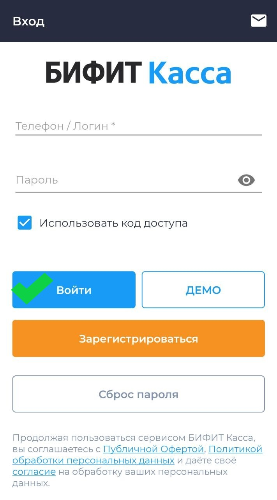

## Сокращения

**ККТ** – Контрольно-кассовая техника

**ККМ** – Контрольно-кассовая машина

**ЛМ ЧЗ** – Локальный модуль Честного знака 

**МРЦ** – Максимальная розничная цена

**ОФД** – Оператор фискальных данных

**ПТК** – Программно-технический комплекс

**РМК** – Рабочее место кассира 

**СБП** — Система быстрых платежей 

**ТС ПИоТ** — Техническое средство получения информации о товаре

**ФН** – Фискальный накопитель

**ФФД** – Формат фискальных данных

**ЦТО** – Центр технического обслуживания

**HoReCa** – Hotel, Restaurant, Cafe/Catering, гостинично-ресторанный бизнес

**POS-терминал** — платёжный терминал, (Point of Sale — точка продажи)

## Введение

Данное руководство описывает процедуру настройки мобильного приложения **«Касса»** на платформе Android и включает в себя следующие шаги:

- установка приложения на мобильное устройство пользователя;
- подключение и настройка ККМ;
- подключение и настройка банковского POS-терминала.

> По требованию Федерального закона № 54-ФЗ ККМ должна быть поставлена на учёт в ФНС. На самой ККМ должна быть проведена процедура регистрации / перерегистрации.
>
> (Федеральный закон от 22.05.2003 № 54-ФЗ «О применении контрольно-кассовой техники при осуществлении расчётов в Российской Федерации»).

## Установка приложения «Касса»

### Из магазина приложений

- Установите мобильное приложение **Касса** на свой смартфон или планшет из магазина [Google Play](https://play.google.com/store/apps/details?id=com.bifit.cashdesk.mobile) или [RuStore](https://www.rustore.ru/catalog/app/com.bifit.cashdesk.mobile). Для этого введите в поиске *БИФИТ Касса*.

- Или отсканируйте QR-код:

### С сайта БИФИТ Касса

1. Перейдите в **[Центр загрузок БИФИТ Касса](https://kassa.bifit.ru/support/)**.  
2. Прокрутите страницу вниз до раздела **Касса**.
3. Скачайте установочный файл для **Android**. 
4. Запустите скачанный файл и дождитесь окончания установки.

## Запуск приложения

При первом запуске приложения доступны следующие действия:

- регистрация (создание учётной записи пользователя с помощью кнопки **Зарегистрироваться**);
- авторизация (**Войти**);
- восстановление пароля от учетной записи (**Сброс пароля**);
- создание кода доступа для входа в приложение (опция **Использовать код доступа**). Используется по желанию.

## Создание новой учётной записи

### Регистрация

*Если у вас уже есть учётная запись, перейдите в раздел* **[Авторизация](#авторизация)**.

> **Важно!**
> 
> Учётную запись сотрудника создаёт руководитель организации или другой пользователь с правами администратора в личном кабинете **БИФИТ Касса**.

После нажатия кнопки **Зарегистрироваться** при первом запуске приложения вы перейдёте к регистрации новой учетной записи.

1. Заполните все поля на открывшемся экране и нажмите **Далее**.
2. Введите код подтверждения из SMS и нажмите кнопку **Зарегистрироваться** для завершения регистрации.
3. Если на начальном экране была выбрана опция **Использовать код доступа**, откроется окно создания кода для быстрого входа.

### Создание организации

> Новую организацию создаёт руководитель.

Для корректной работы приложения должна быть заведена хотя бы одна организация.

1. Заполните поле **ИНН**. В приложение **Касса** встроен сервис **[Индикатор](https://indicator.bifit.ru)** от компании БИФИТ, который автоматически заполнит поля **Наименование** и **Адрес** после ввода ИНН. Или заполните информацию вручную.
2. Убедитесь, что все данные заполнены корректно, после чего нажмите **Создать** для перехода к следующему шагу.

### Создание Торгового объекта {#создание-торгового-объекта}

Торговый объект или торговая точка – место, где установлена ККМ.

По умолчанию поле **Наименование** будет заполнено названием организации.

1. Задайте **Место расчетов** и выберите **Систему налогообложения**. 
2. Если вы используете несколько систем налогообложения в одной **организации**, вы можете выбрать их, отметив галочками. 
3. К одной учетной записи может быть привязано несколько **Торговых Объектов** с разными системами налогообложения
4. Нажмите **Создать** для завершения создания торгового объекта.

## Авторизация {#авторизация}

1. Если у вас есть существующая учётная запись, введите данные для авторизации — телефон и пароль. Нажмите **Войти**.
2. Если при первом входе в приложение включена опция **Использовать код доступа**, появится окно установки кода доступа.
3. Повторите код доступа.
4. Если у вас несколько организаций, выберите нужную из списка.
5. Выберите торговый объект.
6. Настройте подключение ККТ.
7. Настройте подключение платёжного терминала.

## Подключение ККТ

После создания **[Торгового объекта](#создание-торгового-объекта)** ККТ подключится автоматически, при условии, что кассовый аппарат подключён к устройству и включён.

1. Если необходимо заново подключить ККТ, зайдите в раздел меню **Настройки**. 
2. Выберите пункт **ККТ**.
3. Нажмите **+** в правом нижнем углу экрана для создания нового подключения, выберите производителя ККТ и нажмите **Далее**. Не меняйте настройки соединения.
4. Нажмите **Сохранить**.

 

## Подключение платёжного терминала

Ознакомьтесь с этим разделом, если собираетесь подключить к вашему Android-устройству банковский терминал. Доступно подключение по кабелю, по сети или использование встроенного терминала.

> В инструкции использован банковский терминал от Сбербанка, встроенный в ККТ ПЭЙМОБ-Ф.

1. Перейдите в раздел **Платёжные терминалы**.
2. Нажмите **+** в нижнем правом углу экрана и выберите модель POS-терминала.
3. Выберите тип подключения **Платежное ядро** и количество печатаемых слип-чеков.
4. Нажмите **Сохранить** для завершения настройки подключения.
5. Теперь в этом разделе будут отображаться подключенные устройства.

## Дополнительные настройки

В разделе **Дополнительно** следующие параметры:

### Касса

- **Автоматическое подключение к ККТ**. Осуществляет автоматическое подключение к кассовому аппарату при запуске приложения.
  Нужно для корректной передачи чеков из ККМ в ОФД в случае, если настройка связи с ОФД происходит через интернет на смартфоне.
  В противном случае подключение к кассовому аппарату происходит в момент печати чека.
- **Использовать пул касс**. Подключается к случайной кассе при наличии расшаренных касс (общих касс).
  Параметр используется для работы с несколькими кассами.
- **Отложенные чеки**. Откладывает чеки при печати на нескольких кассах.
- **Печать ссылки на магазин**. Добавляет возможность печати ссылок на магазин в конце чека.
  

### Смена

- **Контролировать закрытие смены**. Добавляет возможность уведомления о необходимости закрытия смены.
- **Время контроля смены**. Позволяет установить конкретное время для уведомлений.
- **Автоматическое закрытие смены**. Позволяет автоматически закрывать смену, если она превысила 24 часа.
- **Печать отчётов**. Управление автоматической печатью отчёта при закрытии смены.

### Справочник товаров и услуг

- **Сортировка номенклатур**. Добавляет возможность сортировки номенклатуры по частоте использования.
- **Изображение номенклатуры**. Загружает изображение номенклатуры из личного кабинета **БИФИТ Касса**.
- **Окно ввода количества товара**. Предлагает ввести количество перед добавлением любого товара. 
  Если параметр не активен, окно ввода количества отображается только для весового товара.
- **Остатки маркированного товара**. Добавляет возможность проверки наличия маркировки при продаже.
- **Проверять остаток при добавлении в чек**. Проверка наличия нулевых и отрицательных остатков добавленного в чек товара.
- **Отображение инвентаризации**. Позволяет отображать инвентаризацию на экране устройства с учётом цены продажи.

### Чек

- **Печать кассира в чеке**. Настраивает текст имени кассира в чеке.
- **Тип чека по умолчанию**. Позволяет выбрать тип чека по умолчанию: *Приход*, *Возврат прихода*, *Расход*, *Возврат расхода*, *Чек коррекции*.
- **Отбрасывать копейки**. Округляет итоговую сумму чека до рубля в меньшую сторону.
- **Печать артикулов**. Добавляет артикулы в название номенклатуры в чеке.
- **Адрес покупателя**. Позволяет указать адрес электронной почты покупателя для отправки чека.
- **Место расчёта**. Настраивает запись тега места расчёта (*Установленный в кассе* или *Из торгового объекта*).
- **Печать логотипа в чеке**. Добавляет изображение логотипа в печать чека.
- **Порядковые номера позиций в чеке**. Позволяет добавить отображение порядкового номера каждой позиции в чеке.

- **Фискализация чеков**. Включает или отключает фискализацию чека при продаже.
- **Сторонние приложения**. Добавляет возможность передачи чеков для печати из сторонних приложений.
- **Автоинкассация**. Добавляет возможность закрыть смену с автоматическим обнулением счётчика наличности в денежном ящике.
- **Группировка позиций**. Добавялет возможность группировать позиции с одинаковым наименованием в одну запись с суммированным количеством.
- **Отключить печать чека**. Отключает печать чека при отправке электронного чека клиенту.

- **Без проверки кода маркировки**. Отменяет проверку кода маркировки по ФФД 1.2.
- **Контроль МРЦ**. Добавляет возможность использовать максимальную розничную цену при продаже сигарет.
- **Срок годности**. Добавляет возможность проверять срок годности товара при считывании Data Matrix. 
- **Внесение предоплаты (Онлайн-заказ)**. Выбор способа расчёта при внесении предоплаты.
- **Печать пречека**. Добавляет возможность печати пречека на экране формирования чека.
- **Печать характеристики**. Добавляет возможность печати характеристики товара в чеке.
  

### Разрешительный режим

- **Упрощённое принятие решения о продаже маркированного товара**. Разрешает реализацию товаров, не прошедших проверку в «Честном знаке».
- **Локальное хранение данных КМ**. Позволяет сохранить информацию о проданных кодах маркировки в локальную базу данной системы. 
  

### Продажа по свободной цене

- **Наименование позиции**. Наименование позиции по умолчанию при продаже по свободной цене.
- **Предмет расчёта**. Выбор предмета расчёта при продаже по свободной цене.
- **Тип НДС**. Выбор типа НДС при продаже по свободной цене.

### Весовой штрихкод

- **Шаблон**. Указание шаблона весового штрихкода.

### Алкоголь

- **Начало продажи алкоголя**. Позволяет установить время, с которого начинается продажа алкоголя.
- **Конец продажи алкоголя**. Позволяет установить время, в которое продажа алкоголя прекращается.

### Платёжный терминал

- **Задержка печати слип-чека**. Установка времени ожидания между печатью слип-чека и его копии в секундах. 
  Используется для касс, не поддерживающих автоматическую обрезку чека.

### Оплата

- **СНО по умолчанию**. Позволяет выбрать тип СНО.
- **Быстрая оплата**. Автоматически заполняет сумму.
- **Запретить смешанные типы оплаты**. Разрешает только один тип оплаты.
- **Продажа в 1 клик**. Позволяет включить возможность перехода на экран оплаты по клику на товар.
- **Не фискализировать 0 чеки**. Позволяет не фискализировать чек, если его сумма равна нулю.

### Сканирование штрихкодов

- **Подсветка при сканировании**. Автоматически включает фонарик для подсветки штрихкода.

### Остатки товаров

- **Отображать остатки товаров**. Позволяет включить отображение остатков товара.
- **Настройка координатора**. Позволяет включить синхронизацию остатков между Android- и Desktop-версиями приложения *Касса* и *Касса Розница* при работе РМК по единой сети.

> Настройка будет работать только при правильно настроенном IP-адресе/порте РМК и верно указанном пароле.

### Система {#система}

- **Сетевой журнал**. Активирует формирование сетевого журнала.
- **Тип синхронизации данных**. Позволяет выбрать тип синхронизации данных номенклатуры в справочнике. Возможные варианты:
  - *Инкрементальный*. Может использоваться, если данные в справочнике редактируются редко.
  - *Полный*. Может использоваться, если данные в справочнике редактируются часто.
- **Использовать для HoReCa**. Позволяет использовать устройство в гостинично-ресторанной сфере (Hotel, Recreation, Cafe/Catering).
- **Включить ТС ПИоТ**. Включает проверку маркированного товара в ТС ПИОТе.

### СБП

- **Формат вывода QR**. Позволяет вывести QR-код для оплаты одним из способов:
  - экран устройства;
  - QR-дисплей;
  - бумажный чек.

### Локальный модуль Честного знака

В этом разделе можно настроить синхронизацию между приложением и [локально установленным модулем Честного Знака](https://xn--80ajghhoc2aj1c8b.xn--p1ai/local-module/).

Для синхронизации необходимо указать следующие параметры:
  
- IP-адрес модуля;
- Порт-модуля;
- Логин пользователя;
- Пароль пользователя.

Убедитесь, что данные введены верно, и нажмите **Инициализировать ЛМ ЧЗ** внизу экрана. Индикатором успешной синхронизации будет появление информации в журнале, который находится над кнопкой инициализации.

## Интеграция с ТС ПИоТ

1. Активируйте опцию интеграции с **ТС ПИоТ** в разделе **[Система](#система)**.
2. При добавлении товара в чек отсканируйте Data Matrix.
3. После нажатия **Итог** в модуль ТС ПИоТ отправится запрос на проверку кода маркировки. Результаты проверки отобразятся в диалоговом окне.
4. Если результат проверки положительный, нажмите **Далее**.
5. Если результат проверки отрицательный, исключите заблокированные к продаже товары и продолжите пробитие чека без них.

