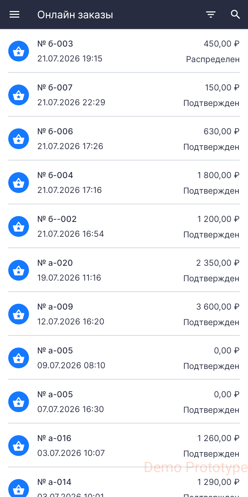
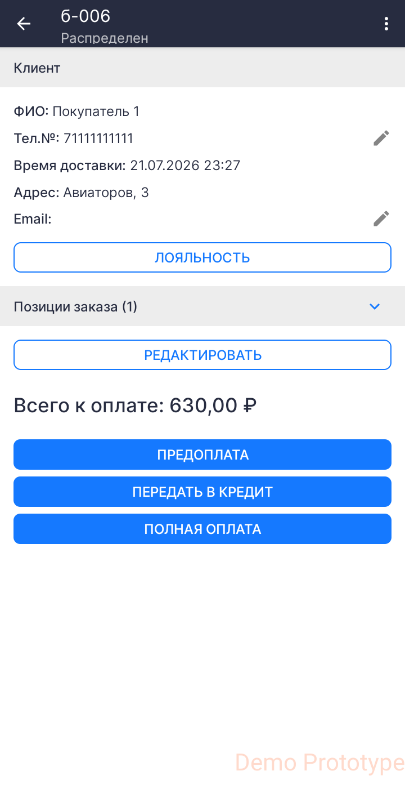
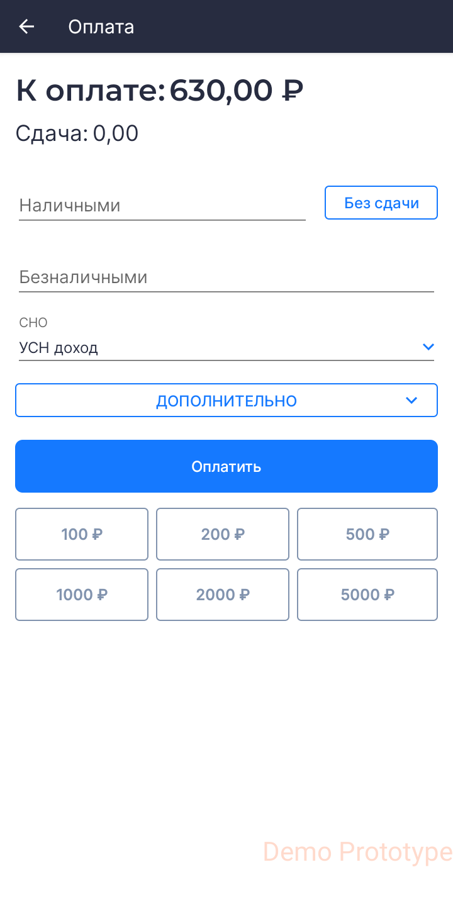
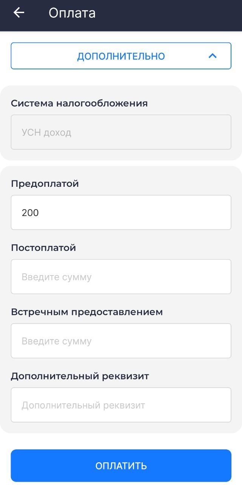

# Руководство пользователя

## Сокращения

**ККТ** — Контрольно-Кассовая Техника

**ОФД** — Оператор Фискальных Данных

**РМК** — Рабочее Место Кассира

**СНО** — Система Налогообложения

**ФНС** — Федеральная Налоговая Служба

**ФФД** — Формат Фискальных Документов

**GTIN** — Global Trade Item Number, глобальный идентификатор товара

**POS-терминал** — платёжный терминал, (Point of Sale — точка продажи)

## Введение

Данный документ рассчитан на пользователей мобильного приложения **«Касса 2.0»** и описывает процедуру по редактированию справочника товаров и оформлению фискальных документов (чеков).

## Запуск приложения

1. При входе в приложение выберите учётную запись.
2. Введите код доступа.
3. Выберите организацию и торговый объект. Если в приложении задана одна организация или один торговый объект, то приложение выберет их автоматически.

.jpg>)

.jpg>)

.jpg>)

.jpg>)

Произойдёт переход на экран **РМК**.

.jpg>)

## Редактирование справочника товаров

Приложение позволяет вести учёт реализуемых позиций и добавлять их в справочник товаров организации или торгового объекта.

Редактировать справочник товаров может пользователь с правами администратора или старшего кассира.

### Добавление товаров в справочник

На экране РМК перейдите в меню и выберите раздел **Товары**.

На этом экране можно добавить товар или группу товаров.

#### Добавление товара

1. На экране справочника нажмите **+** и выберите **Добавить товар**.
2. В карточке товара необходимо ввести данные о товаре:

- Наименование
- Цена
- НДС
3. Нажмите **Создать**.

Опция **Отображать только в текущем торговом объекте** скрывает товар от других торговых 
объектов организации. 

#### Добавление категории

1. На экране справочника нажмите **+** и выберите **Добавить категорию**.
2. Введите наименование категории и нажмите **Создать**.
3. На экране справочника нажмите на папку.
4. Создание товаров в папке категории происходит так же, как на главном экране справочника.

#### Добавление товаров со штрихкодом

При добавлении товара в соответствующем поле введите значение или отсканируйте штрихкод на товаре.

> Чтобы подключить сканер штрихкода в режиме эмуляции клавиатуры, в приложении **Касса** не нужно производить специальных настроек.
>
> Убедитесь, что сканер работает по USB или Bluetooth в режиме эмуляции клавиатуры. Эту информацию можно уточнить у продавца оборудования. Подключите сканер к USB-разъёму или создайте Bluetooth-соединение с устройством.
>
> Для работы с маркированными товарами сканер должен быть настроен в режиме эмуляции COM-порта.

Если вы хотите использовать в качестве сканера штрихкода встроенную камеру устройства, на экране нажмите кнопку сканера штрихкода.

Поместите штрихкод в объектив камеры. Данные появятся в соответствующем поле.

#### Добавление весового товара или товара, измеряемого дробным количеством

1. При добавлении товара в окне карточки товара нажмите **Дополнительно**.
2. Выберите опцию **Дробное количество**.
3. Выберите единицу измерения (например, килограмм) — цена установится за одну единицу. При продаже укажите количество товара: например, 2,5 кг.

#### Добавление маркированной продукции

1. При добавлении товара в окне карточки товара нажмите **Дополнительно**.
2. В поле **GTIN** введите значение GTIN вручную или отсканируйте код Data Matrix.
3. Выберите тип маркировки.

> Сканирование GTIN не предусмотрено для следующих значений:
>
> - алкоголь;
> - СИЗ;
> - ветеринарный препарат.
>
> Для этих товаров необходимо выбрать соответствующий тип маркировки.

#### Удаление товаров из справочника

Чтобы удалить товар, на экране справочника откройте карточку товара, однократно нажав на него. В правом верхнем углу выберите удаление.

Также на экране справочника можно удалить товар, выбрав его долгим нажатием. В правом верхнем углу экрана появится опция удаления.

Чтобы удалить несколько товаров, нужно выбрать их долгим нажатием, затем выбрать удаление.

## Экран РМК

На экране **РМК** происходит оформление покупок:

- оформление товаров и услуг;
- редактирование позиций в чеке;
- назначение скидок.

После входа в приложение экран рабочего места кассира по умолчанию открывается в режиме **Приход**. Выбрать другую кассовую операцию можно в меню в верхнем левом углу. Доступны следующие операции:

- Приход
- Возврат прихода
- Расход
- Внесение
- Выплата

После добавления товара в чек на экране рабочего места кассира доступны следующие функции:

-  **Добавить информацию о клиенте** — в окне можно указать ФИО, номер телефона и/или E-mail клиента для отправки электронной копии чека.
-  **Добавить скидку на чек** — доступен выбор процентной скидки на товар. После добавления скидка распределяется по всем позициям в чеке.
-  **Добавить комментарий в чек**.
-  **Удалить чек**.
-  **Отложенные чеки** — откроется вкладка со всеми отложенными чеками, которые были не до конца сформированы.
-  **Добавить новый чек** — откроется новый пустой чек без товаров.

Для оплаты нажмите **Итог: (сумма)**.

> Ниже рассмотрен пример работы приложения с фискальным документом «Приход». Он оформляется кассиром при продаже товаров и услуг.

На экране в режиме **Приход** доступны следующие действия:

- добавление товара в чек по штрихкоду;
- добавление товара в чек из справочника: **Добавить товар**;
- добавление товара в чек с указанием наименования, цены и НДС: **Свободная цена**.
  
### Добавление товара в чек по штрихкоду

Перейдите в окно РМК и отсканируйте штрихкод на товаре.

При использовании встроенной камеры откроется окно сканирования штрихкода. Поместите штрихкод в окно сканирования. При наличии товара в справочнике в нижней части экрана появится его наименование.

При повторном сканировании товара его количество изменится.

При плохом освещении воспользуйтесь фонариком, чтобы подсветить штрихкод.

Нажмите кнопку подтверждения  для добавления товара в чек.

### Добавление в чек товара из справочника

Нажмите **Добавить товар** в правой нижней части экрана.

Откроется справочник товаров.

Выберите товары и нажмите кнопку подтверждения . Выбранные позиции добавятся в чек и будут отображаться на экране РМК.

### Добавление в чек товара по свободной цене

Товар по свободной цене — товар, не внесённый в справочник товаров. Цена на такой товар устанавливается вручную в момент продажи.

Для добавления в чек товара по свободной цене нажмите **Свободная цена** в левой нижней части экрана.

В открывшемся окне введите название и цену товара. 

Нажмите **Добавить в чек** или **Оплатить**, если это единственный товар в чеке.

.jpg>)

В разделе **Дополнительно** можно изменить **количество товара**, **способ расчёта**, **предмет расчёта**, **НДС**

.jpg>)

### Добавление в чек весового товара

**Весовой товар** — продукция, измеряемая дробными величинами, например килограммами, граммами, литрами.

Для добавления в чек весового товара необходимо передать в приложение **точное количество товара**, например 0,532 кг.

#### Добавление в чек весового товара вручную

Добавление весового товара вручную означает, что у кассира есть возможность измерить вес товара, например на электронных весах, присутствующих на **рабочем месте кассира**, но не подключённых к устройству.

Для добавления в чек весового товара на экране **Приход** нажмите **Добавить товар**, перейдите в справочник, выберите весовой товар и в окне **количество товара** введите точное количество граммов или килограммов.

#### Добавление в чек весового товара электронными весами

> Для автоматизации рабочего места кассира приложение «Касса» позволяет подключить электронные весы к Android-устройству по USB. Подключите весы к устройству по USB, перейдите в **Настройки** → раздел **Весы**. Выберите тип весов и настройте подключение.

Для добавления в чек весового товара на экране **Приход** нажмите **Добавить товар**, перейдите в справочник, выберите весовой товар. Положите товар на весы. Поле **Количество товара** заполнится автоматически. При изменении веса нажмите **Взвесить**.

### Продажа маркированной продукции

1. Отсканируйте код **Data Matrix**, нанесённый на упаковку. При выбытии алкогольной продукции необходимо отсканировать **Data Matrix** на акцизной марке.
2. На экране появятся результаты проверки маркировки.
3. Если результат проверки положительный, нажмите **Далее**.
4. Если результат проверки отрицательный, исключите заблокированные к продаже товары и продолжите пробитие чека без них.

### Приём платежей в качестве агента

**Агентский платёж** — приём денег за услуги или товар в пользу третьих лиц, например, при оплате ЖКХ или сотовой связи.

> Для продажи агентских услуг пользователь с правами администратора должен предварительно выполнить настройки в **Личном кабинете БИФИТ Касса**. После этого нужно перезагрузить приложение, чтобы агентская услуга отображалась на РМК в списке товаров.

Добавьте агентскую услугу в чек как обычный товар, укажите цену и нажмите **Оплатить**.

### Редактирование позиций в чеке

После добавления позиции в чек её можно отредактировать или удалить из чека.

Чтобы скопировать или удалить позицию, нажмите на неё и удерживайте, затем выберите нужное действие во всплывающем окне.

Однократное нажатие на позицию в чеке откроет окно редактирования. Здесь можно изменить **наименование**, **цену** и **количество**.

Для завершения редактирования позиции в чеке нажмите **Сохранить**.

На экране РМК нажмите **Итог** для перехода к оплате.

## Экран оплаты

На экране оплаты доступны следующие варианты оплаты:

**Безналичная оплата**: банковская карта или QR-код.
**Наличные деньги**.
**Другие способы оплаты**: смешанная оплата.

**Безналичная оплата**

1. Выберите способ оплаты **Банковская карта или QR-код**. 
2. На окне оплаты покупатель должен приложить карту к терминалу или отсканировать QR-код. 

**Наличные деньги**
   
1. Выберите способ **Наличные**.
2. Введите сумму, полученную от покупателя. Сумма сдачи рассчитается автоматически.
3. Нажмите **Оплатить**.

Если на экране оплаты выбрать сопосjб **Без сдачи**, фискализация произойдёт сразу. 

**Другие способы оплаты**

1. Выберите способ **Смешанная оплата**.
2. Введите сумму наличных денег и сумму базналичной оплаты в соответствующих полях.
3. Нажмите **Оплатить**.

## Лояльность

Программа лояльности создаётся в **Личном кабинете БИФИТ Касса**.

1. Для добавления клиента в программу лояльности в приложении Касса 2.0 перейдите в раздел **Лояльность**.
2. Нажмите **+**.
3. Введите информацию о клиенте, выберите программу лояльности, сгенерируйте номер карты.
4. Нажмите **Добавить**. 
   

### Применение скидки

**Ручная скидка**:

1. На экране формирования чека нажмите значок скидки.
2. Нажмите поле **Ручная скидка**.
3. Выберите процент скидки или введите другое число, например, 7.
4. Нажмите **Сохранить**.
   

### Применение программы лояльности

1. На экране формирования чека нажмите значок скидки.
2. На открывшемся экране нажмите **Добавить**
3. Отсканируйте карту лояльности или купон, или введите номер вручную. Нажмите добавить.
4. Нажмите **Сохранить**.
   

## Онлайн-заказы

Перейдите в раздел **Онлайн-заказы**.

Онлайн-заказы отображаются в двух статусах:

1. **Подтверждён** — заказ выгружен, но не распределён на конкретного кассира.
2. **Распределён** — заказ выгружен и распределён на конкретного кассира.

Чтобы изменить статус заказа с **Подтверждён** на **Распределён**, откройте заказ и нажмите **Взять заказ**.

В окне подтверждения нажмите **Да**.

После распределения заказа, доступны способы оплаты:

- **предоплата** — заказ был оплачен до получения заказа покупателем;
- **передача в кредит** — оплата будет произведена после выдачи заказа покупателю;
- **полная оплата** — оплата происходит в момент выдачи заказа покупателю.
  

После оплаты документ отправится в ФНС, и онлайн-заказ перестанет отображаться в 
приложении. 

## Заказ на закупку

1. Для оформления заказа на закупку перейдите в раздел **Учётные документы** и выберите **Заказ на закупку**. 
2. Нажмите **+**.
3. Нажмите **Добавить товар**.
4. Выберите товары из справочника и укажите необходимое количество.
5. Нажмите **Отправить заказ**.

> Приложение «Касса 2.0» позволяет сформировать только заказ на закупку. Остальная работа с заказом производится в личном кабинете БИФИТ Касса.

## Другие кассовые документы

### Возврат прихода 

1. Перейдите в раздел **Касса** и выберите **Возврат прихода**.
2. Добавьте товары в чек и нажмите **Итог**.
3. На экране оплаты произведите возврат денежных средств.

> Интерфейс и порядок формирования документа **Возврат прихода** аналогичны интерфейсу и порядку формирования документа **Приход**.

***Документ передаётся в ФНС.***

### Возврат прихода из истории чеков

При возврате товара с возвратом денежных средств на карту клиента необходимо провести документ **Возврат прихода** из **Истории чеков**.

1. Перейдите в раздел **История чеков** в меню приложения.
2. Выберите чек, позицию из которого необходимо вернуть. В верхнем правом углу нажмите на иконку меню и выберите **Возврат**.
3. Автоматически откроется документ **Возврат прихода** с уже заполненными позициями.
4. Если в исходном документе больше позиций, чем покупатель планирует вернуть, удалите лишние позиции.
5. Нажмите **Итог** и перейдите в окно **Оплаты**.

> Если подключён банковский терминал, а исходный документ «Приход» был оплачен банковской картой, произойдёт обращение к банковскому терминалу для возврата денежных средств покупателю. Если возврат товара произошёл в тот же день, денежные средства вернутся быстрее, чем через несколько дней после покупки.

***Документ передаётся в ФНС.***

### Расход

**Документ расхода** оформляется при покупке товаров или услуг организацией у физического лица. Порядок оформления документов аналогичен документам **Приход** и **Возврат прихода**.

***Документ передаётся в ФНС.***

### Возврат расхода

Возврат расхода оформляется организацией при возврате ранее приобретённой продукции у физического лица.

Порядок оформления документа аналогичен документу **Возврат прихода**.

***Документ передаётся в ФНС.***

### Внесение

Документ предназначен для внесения наличных денежных средств в кассу (ККТ).

Укажите:

- сумму
- основание внесения;
- комментарий.

***Документ не передаётся в ФНС.***

### Выплата

Документ предназначен для выдачи наличных денежных средств из кассы (ККТ).

Укажите:

- сумму
- основание выплаты;
- комментарий.

***Документ не передаётся в ФНС.***

### Коррекция

> Кассовый чек коррекции (бланк строгой отчётности коррекции) — формируется пользователем в целях исполнения обязанности по применению ККТ в случае осуществления ранее таким пользователем расчёта без применения ККТ либо в случае применения ККТ с нарушением требований законодательства Российской Федерации о применении ККТ.
> 
> (Федеральный закон от 03.07.2018 № 192-ФЗ, которым внесены изменения в Федеральный закон от 22.05.2003 № 54-ФЗ «О применении контрольно-кассовой техники при осуществлении расчётов в Российской Федерации»).

Чек коррекции можно оформить **в любой день**.

#### Коррекция по ФФД 1.05

1. Перейдите в раздел **Коррекция**.
2. Выберите **тип чека коррекции**:

- **Приход**
- **Возврат прихода**
- **Расход**
- **Возврат расхода**

3. В окне формирования чека нажмите кнопку **Продолжить**, не добавляя товары в чек.

4. В окне **Регистрация** укажите:

- **Основание для коррекции**
    - По предписанию.
    - Самостоятельная.
- **Дата документа**.
- **Номер документа**.
- **Сумма коррекции**.

1. Нажмите **Продолжить**.
2. Выберите способ оплаты. В разделе **Дополнительно** можно указать **тип оплаты** и **дополнительный реквизит**.
3. Нажмите кнопку **Оплатить**.

***Документ передаётся в ФНС.***

#### Коррекция по ФФД 1.2

1. Перейдите в подраздел **Коррекция**.
2. Выберите **тип коррекции**, который необходимо создать:

- **Приход**
- **Возврат прихода**
- **Расход**
- **Возврат расхода**

3. Добавьте в чек товары, по которым происходит коррекция и нажмите **Итог**.
4. В окне **Регистрация** укажите:

- **Основание для коррекции**
    - По предписанию.
    - Самостоятельная.
- **Дата документа**.
- **Номер документа**.
- **Сумма коррекции**.

5. Нажмите кнопку **Продолжить**.
6. Выберите способ оплаты. В разделе **Дополнительно** можно указать **тип оплаты** и **дополнительный реквизит**.
7. Нажмите кнопку **Оплатить**.

> Для проведения коррекции по ФФД 1.2, в отличие от коррекции по ФФД 1.05, необходимо добавить товары в чек. 

***Документ передаётся в ФНС.***

## Работа с отчётами

Перейдите в раздел **Отчёты**. 

### Открытие смены

Отчёт об **открытии смены** печатается **автоматически** при совершении первой продажи, если смена не была открыта вручную.

Для открытия смены вручную перейдите в раздел **Отчёты** и нажмите **Открыть смену**.

### Закрытие смены

Для закрытия смены перейдите в подраздел **Отчёты** и нажмите **Закрыть смену**.

На кассе распечатается отчёт о закрытии смены.

> На некоторых кассах реализована печать сверки итогов при закрытии смены. Максимальная продолжительность смены 24 часа.
>
> Если во время совершения кассовой операции смена превысила 24 часа, то система автоматически закроет смену и откроет новую, если включена настройка **Автоматическое закрытие смены**. Если настройка в приложении выключена, то необходимо вручную закрыть и открыть смену, а затем совершить кассовую операцию.

### Проверка связи с ОФД

Отчёт необходим для проведения самостоятельной проверки кассой подключения к ОФД.

### Отчёт по кассовым операциям

*Не является фискальным документом, предназначен для сбора статистики по кассовым операциям.*

1. Перейдите в раздел **Отчёты**.
2. Выберите **Отчёт по кассовым операциям**.
3. Выберите **интервал** формирования отчёта:

    - за период
    - за сегодня
    - за вчера
    - за неделю
    - за месяц

4. Нажмите **Распечатать**.

## Поддержка

В разделе содержится следующая информация:

- версия приложения;
- контакты организации-разработчика;
- ссылки на социальные сети организации-разработчика;
- опция **Отправить логи разработчикам** — специалист поддержки может запросить отправку журнала событий для диагностики и решения проблем с приложением.

> Поддержка ООО "БИФИТ Касса":
> 
> [7 (499) 704-06-98](tel:+74997040698)

