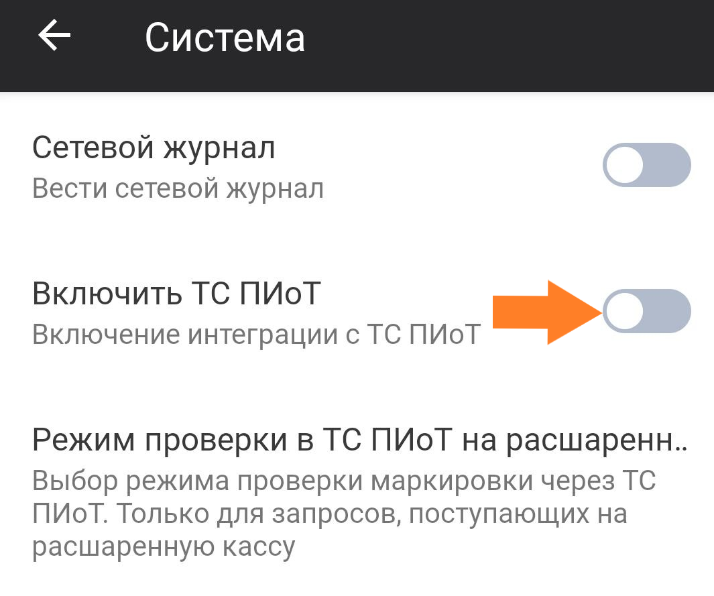

## Сокращения

**ККТ** – Контрольно-кассовая техника

**ККМ** – Контрольно-кассовая машина

**ЛМ ЧЗ** – Локальный модуль «Честного знака»

**ОИСМ** – Оборот идентифицированных средств маркировки 

**ОФД** – Оператор фискальных данных

**ПТК** – Программно-технический комплекс

**СБП** – Система быстрых платежей

**ФН** – Фискальный накопитель

**ЦТО** – Центр технического обслуживания

**GPS** — Global Positioning System, глобальная система позиционирования

**GTIN** — Global Trade Item Number, глобальный идентификатор товара

**POS-терминал** — платёжный терминал, (Point of Sale — точка продажи)

## Введение

Данное руководство описывает процедуру настройки мобильного приложения **«Касса Курьер»** на платформе Android и включает в себя следующие шаги:

- установка приложения на мобильное устройство пользователя;
- подключение и настройка ККМ;
- подключение и настройка банковского POS-терминала.

> По требованию Федерального закона № 54-ФЗ ККМ должна быть поставлена на учёт в ФНС. На самой ККМ должна быть проведена процедура регистрации / перерегистрации.
>
> (Федеральный закон от 22.05.2003 № 54-ФЗ «О применении контрольно-кассовой техники при осуществлении расчётов в Российской Федерации»).

## Установка приложения «Касса Курьер»

### Из магазина приложений

- Установите мобильное приложение **Касса Курьер** на свой смартфон или планшет из магазина [Google Play](https://play.google.com/store/apps/details?id=com.bifit.cashdesk.mobile.orders) или [RuStore](https://www.rustore.ru/catalog/app/com.bifit.cashdesk.mobile.orders). Для этого введите в поиск *Касса Курьер*. 

- Или отсканируйте QR-код:

*Google Play*

*RuStore*

### С сайта БИФИТ Касса

1. Перейдите в **[Центр загрузок БИФИТ Касса](https://kassa.bifit.ru/support/)**.  
2. Прокрутите страницу вниз до раздела **Касса Курьер 2.0**.
3. Скачайте установочный файл для *Android*. 
4. Запустите скачанный файл и дождитесь окончания установки.

## Запуск приложения

При первом запуске приложения введите данные учётной записи. 

> **Важно!**
> 
> Учётную запись сотрудника создаёт руководитель организации или другой пользователь с правами администратора в личном кабинете **БИФИТ Касса**.

При первом запуске приложения можно активировать опцию **Установить код доступа** для защиты от несанкционированного входа. 

Если эта опция активирована, вы перейдёте на экран установки кода доступа. Установите код и повторите его. 

При последующем запуске приложения будет осуществлён «быстрый» вход без ввода логина и пароля — только с кодом. 

Если в личном кабинете несколько организаций, нужно выбрать одну из них для работы.

Произойдёт переход на экран заказов.

## Подключение ККТ

1. Перейдите в меню. 
2. В открывшемся меню выберите раздел **Настройки**.
3. Выберите пункт **ККТ**.
4. Нажмите **+**.
5. Выберите вендора (производителя ККТ).
6. Нажмите **Проверить подключение** и **Сохранить**. ККТ появится в списке подключённых устройств. 

Чтобы удалить ККТ, нажмите **⋮** и выберите **Удалить**.

## Настройка платёжного терминала

1. Перейдите в настройки и выберите пункт **Платёжные терминалы**.
2. Нажмите **+**, чтобы добавить подключение.
3. Выберите вендора (производителя терминала).
4. Укажите параметры подключения. Нажмите **Проверить подключение** и **Сохранить**. 
   

## Подключение принтера

1. Перейдите в настройки и выберите пункт **Принтеры**.
2. Нажмите **+**, чтобы добавить подключение.
3. Выберите вендора (производителя принтера).
4. При необходимости укажите параметры подключения. Нажмите **Проверить подключение** и **Сохранить**. 

## Дополнительные настройки

В разделе **Дополнительные настройки** доступна настройка следующих параметров:

- Заказы;
- Смена;
- Чек;
- Платёжные терминалы;
- Разрешительный режим;
- Оплата;
- Система;
- Локальный модуль «Честного знака».

Для детальной настройки приложения нажмите на нужный параметр.

### Заказы

- **Скрыть просроченные заказы**. Не отображает заказы с истёкшей датой доставки.
- **Геолокация при оплате**. Фиксирует местоположение устройства по GPS в момент оплаты заказа в чеке.
- **Заполнять дополнительный реквизит**. Автоматическое заполнение дополнительного реквизита.
- **Действие с предоплаченным заказом**. Позволяет настроить приложение так, чтобы чек не печатался при выдаче заказа, если он уже был оплачен получателем заранее.
- **Действие с заказом на Забор товаров**. Определяет, нужно ли печатать кассовый чек при передаче товара курьеру:
- Печатать — чек будет напечатан при заборе товара;
- Не печатать — чек при заборе печататься не будет (например, если чек оформляется при вручении клиенту).
- **Отключить лояльность в онлайн-заказах**. Отключает программы лояльности при покупке товаров онлайн.

### Смена

- **Контролировать закрытие смены**. Приложение заранее напоминает о необходимости закрыть смену. Позволяет установить  **Время контроля смены** — время, в которое будет приходить уведомление. 
- **Печать отчётов от имени номинального кассира**. Формирование чеков с указанием заранее заданного сотрудника организации, а не текущего курьера.
- **Автоматическое закрытие смены**. Приложение автоматически закроет смену, превысившую 24 часа. Опция позволяет установить **Время закрытия смены**.
- **Печать отчётов**. Включает или отключает автоматическую печать отчёта при закрытии смены.
- **Печатать "Отчёт по типам оплат"**. Показывает способы оплаты (наличные, банковская карта, СБП и т.д.)

### Чек

- **Печать кассира в чеке**. Позволяет настроить отображение имени и роли кассира в чеке (например: Кассир + Имя Фамилия).
- **QR-код и печать на принтере**. Позволяет настроить вывод данных при удалённой фискализации:
- Не отображать — не печатать и не показывать;
- Ссылка на чек — напечатать QR-код или дать ссылку для скачивания электронного чека;
- Напечатать фискальные данные.
- **Отключить печать чека**. Позволяет отключить печать чека при отправке электронного чека покупателю.
- **Место расчёта**. Показывает, где именно произошёл расчёт с покупателем. Настройка позволяет выбрать, какой адрес будет записан в этот тег:
- Из доставки — адрес, по которому курьер доставил заказ (или данные GPS о нахождении курьера в момент оплаты);
- Из организации — юридический адрес компании;
- Установленный в кассе — адрес, который задан в настройках кассового аппарата.
- **Без проверки кода маркировки**. Отключает обязательную проверку кода маркировки при добавлении товара в чек.

- **Проверять GTIN при сканировании маркированного товара**. Сверяет код товара из Data Matrix со справочником перед добавлением в чек.
- **Запрет нулевой стоимости позиции**. Не позволяет добавить в чек товар с нулевой ценой.
- **Срок годности**. Проверяет срок годности товара при считывании DataMatrix.
- **Печать номера заказа в чеке**. Печатает номер заказа в чеке.
- **Объединение позиций в чеке**. Группирует одинаковые товары с разными маркировками в одну позицию в чеке. Коды маркировки всё равно передаются в ОФД.

### Платёжные терминалы

- **Задержка печати слип-чека**. Позволяет вручную установить интервал между печатью чека и копии для отрыва. 
- **Назначение платежа для СБП Райффайзен**. Позволяет настроить состав информации, передаваемой в назначение платежа через СБП от Райффайзенбанка:
- Наименование торгового объекта;
- Способ оплаты;
- Вендор;
- Дата оплаты;
- Название заказа;
- Заводской номер кассы.

### Разрешительный режим

- **Упрощённое принятие решения о продаже маркированного товара**. Позволяет или запрещает продажу маркированного товара, который получил отрицательный результат проверки от «Честного знака».
- **Игнорирование типов проверки в Честном знаке**. Позволяет настроить **Список типов проверки, которые будут игнорироваться**.
- **Удаление маркировок без сканирования товаров**. Убирает из заказа позиции, которые не прошли проверку кода маркировки.
- **Упрощённое отображение результатов проверки в «Честном знаке»**. Показывает общий статус после проверки в системах: «Честный знак», ОИСМ, ФН.
- **Локальное хранение проданных КМ**.  Сохраняет коды маркировки (КМ) проданных товаров в локальную базу приложения. Используется для повторной отправки в «Честный знак», если при продаже не было связи с системой.
- **Использовать переданные данные о проверке в «Честном знаке»**. Позволяет не проверять маркировку при выдаче заказа.

### Оплата

- **Запретить смешанные типы оплаты**. Запрет разных типов оплат в одном чеке.
- **Внесение предоплаты**. Выбор способа расчёта при внесении:
- Предоплата;
- Аванс.
- **Действия с маркированным товаром**. Если маркировка не отсканирована, возможны следующие действия:
- Удалить из заказа;
- Пропустить.
- **Проверка оплат от юрлица**. Включает уведомления о приёме оплаты от юрлица.
- **Лимит наличных для оплаты онлайн-заказов**. Ограничивает количество принимаемых курьером наличных средств от покупателя. 
- **Отображать кастомные методы оплаты**. Включает отображение способов оплаты, настроенных в Личном кабинете БИФИТ Касса.

### Система {#система}

- **Сетевой журнал**. Активирует формирование сетевого журнала.
- **Включить ТС ПИоТ**. Включает проверку маркированного товара через ТС ПИОТ.
  

### Локальный модуль Честного знака

В этом разделе можно настроить синхронизацию между приложением и локально установленным модулем Честного Знака.

Для синхронизации необходимо указать следующие параметры:

- IP-адрес модуля;
- Порт-модуля;
- Логин пользователя;
- Пароль пользователя.

Убедитесь, что данные введены верно, и нажмите Инициализировать ЛМ ЧЗ внизу экрана. Индикатором успешной синхронизации будет появление информации в журнале, который находится над кнопкой инициализации.

## Интеграция с ТС ПИоТ

1. Активируйте опцию интеграции с **ТС ПИоТ** в разделе **[Система](#система)**.
2. После нажатия перехода к оплате в модуль ТС ПИоТ отправится запрос на проверку кода маркировки. Результаты проверки отобразятся в диалоговом окне.
3. Если результат проверки положительный, нажмите **Оплатить**.
4. Если результат проверки отрицательный, исключите заблокированные к продаже товары и продолжите пробитие чека без них.
   

