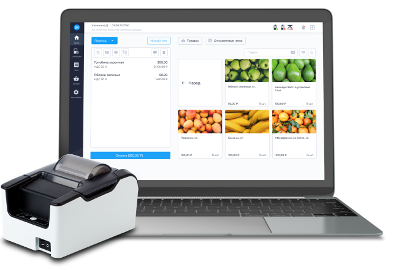

# Документация программного обеспечения «БИФИТ Касса» 

## Разделы

### Личный кабинет БИФИТ Касса

- [Руководство администратора](1web/Руководство ЛК.md)

### Касса Розница (Windows/Linux)

- [Установка и настройка](2desktop/установка/Установка-настройка-Касса-Розница(Windows,Linux).md)
- [Руководство пользователя](2desktop/руководство/Руководство-пользователя Desktop.md)

### Касса (Android)

- [Установка и настройка](3касса/установка/Установка-и-настройка-«Касса»-(android).md)
- [Руководство пользователя](3касса/руководство/Руководство-пользователя-Касса-(android).md)

### Касса 2.0

- [Установка и настройка](4касса 2.0/установка/Установка-и-настройка-Касса-2.0.md)
- [Руководство пользователя](4касса 2.0/руководство/Руководство-пользователя-касса-2.0.md)

### Касса Курьер

- [Установка и настройка](5касса курьер/установка/Установка-и настройка-Касса-Курьер.md)
- [Руководство пользователя](5касса курьер/руководство/Руководство пользователя Касса Курьер.md)

